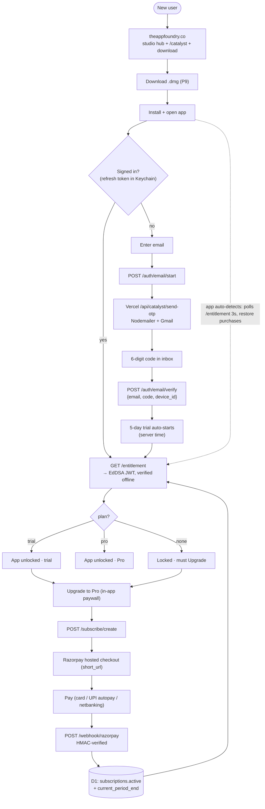

# Catalyst — Go-Live Plan & Tracker

> ## ⚠️ SUPERSEDED IN PLACES — read this first (2026-07-19)
>
> **Catalyst no longer has subscriptions.** It is sold as a **one-time perpetual licence**
> (₹5,999 standard / ₹2,499 student, INR only). Everything in this file about Razorpay *plans*,
> `RAZORPAY_PLAN_*` vars, monthly/yearly pricing, `total_count`, cancel-at-cycle-end, or
> "Manage subscription" is **historical and must not be followed**.
>
> **What replaced it:**
> - Checkout = a one-time Razorpay **Payment Link** (`POST /license/create`,
>   `/license/student/create`). No plans, no plan ids, no mandate.
> - Prices live in `catalyst_worker/wrangler.toml` as `PRICE_STANDARD_INR` / `PRICE_STUDENT_INR`
>   (**minor units** — paise). They are BOTH the charged amount and what `/entitlement` reports,
>   so a price change is a `wrangler deploy` — **prices are no longer hardcoded in the app**
>   (items 7 and Formrules 12.15(f) below are obsolete).
> - `/subscribe/{create,cancel}` now return **410**. `subscribeCreate`, `reconcileSubscription`,
>   `planInterval` and the webhook `subscription.*` branch are **deleted**.
> - USD is deliberately unset until Razorpay approves international payments; an unconfigured
>   currency returns `price_not_configured` rather than failing at checkout.
>
> Pre-launch checklist that still applies: `rzp_live_` keys, live webhook secret (byte-match,
> mode-specific), KYC, a ₹1-style live smoke test, SES production access.


Auth + subscription + trial go-live. **Website not live yet.** Backend = a Cloudflare
**Worker + D1 + KV** in its **own repo `imsg8/catalyst_worker`** (Git-connected to Cloudflare
Workers Builds → push-to-deploy). The `catalyst_pages` repo stays for the static Pages
JSON only. Design rationale + flows: see the auth flowcharts in chat and
`CatalystUnderstanding.md` §27.

**Golden rule:** the Mac app is never trusted. Backend is the only source of truth; the
app just verifies a short-lived, server-signed entitlement JWT.

---

## Architecture (target)
- **Website** (new): magic-link signup + Razorpay Subscriptions checkout.
- **Worker** (`catalyst_worker` repo): auth, `/entitlement`, Razorpay webhook, device-code.
- **D1**: `users`, `devices`, `subscriptions`, `trials`.
- **KV**: short-lived magic-link tokens + device-authorization codes.
- **Mac app**: device-code sign-in → JWT (verify w/ embedded Ed25519 public key) → cache
  for offline grace → locked / trial / pro states + UserView + bottts-neutral avatars.
- **Production API:** `https://catalyst-api.shivanggulati817.workers.dev` (deployed). A
  second Worker/route joins when the website domain is bought.

---

## System flow (end-to-end)



**Tiers:** Website (Vercel/Astro) = marketing + `/api/catalyst/send-otp` only, no payment. Worker
(`catalyst_worker`, Git→Workers-Builds) = all auth/entitlement/subscription + D1 + KV. Static
data (shortcuts/brew/popular/about) = Pages (`catalyst_pages`). Mac app trusts only the signed
JWT; Python install versions come **live from brew** (no backend file).

## Secrets & resources — generate / create
| Name | From | Where it lives |
|---|---|---|
| `catalyst-db` (D1) | `wrangler d1 create catalyst-db` → `database_id` | `wrangler.toml` |
| `SESSIONS` (KV) | `wrangler kv namespace create SESSIONS` → `id` | `wrangler.toml` |
| `JWT_PRIVATE_KEY` | `openssl genpkey -algorithm ed25519 -out jwt_private.pem` | Worker secret |
| `JWT_PUBLIC_KEY` | `openssl pkey -in jwt_private.pem -pubout` | **embed in Mac app** |
| `RAZORPAY_KEY_ID` | Razorpay → Settings → API Keys | Worker secret (public-ish) |
| `RAZORPAY_KEY_SECRET` | Razorpay → Settings → API Keys | Worker secret |
| `RAZORPAY_WEBHOOK_SECRET` | Razorpay → Settings → Webhooks (you set it) | Worker secret |
| `GMAIL_USER` | `usecatalystapp@gmail.com` | **Vercel** env (send fn) |
| `GMAIL_APP_PASSWORD` | Google acct → 2-Step Verification ON → myaccount.google.com/apppasswords (16-char) | **Vercel** env |
| `INTERNAL_EMAIL_SECRET` | random string you make | **both** Vercel env **and** Worker secret |
| `EMAIL_ENDPOINT` | `https://theappfoundry.co/api/catalyst/send-otp` | Worker var |
| Sparkle EdDSA keypair | Sparkle `generate_keys` (private → Keychain, public printed) | **public** → `Info.plist` `SUPublicEDKey`; **private** in Keychain (back it up) |
| Apple Developer ID | Apple Developer acct ($99/yr) → Xcode | local Keychain (codesign + notarize) |

Add secrets via `wrangler secret put <NAME>` or Pages/Worker dashboard → Settings → Vars.
**Never** put `*_SECRET` or `JWT_PRIVATE_KEY` in the app or the static Pages bundle.
**Email:** Workers can't do SMTP → OTP sends from a **Vercel** Node function (Gmail now →
Amazon SES later). Gmail creds on Vercel; `INTERNAL_EMAIL_SECRET` guards the route. App +
website never change on a provider swap (they only call the Worker's `/auth/email/*`).

---

## Phases
1. **Backend scaffold** — `wrangler.toml`, D1 schema (4 tables), KV binding, Ed25519 keys.
2. **Auth** — magic-link signup/login; sessions in KV.
3. **Entitlement** — `GET /entitlement` → signed JWT (plan, exp, features); server-time.
4. **Razorpay** — website checkout (Subscriptions) + `POST /webhook/razorpay` (HMAC-verified).
5. **Trial + abuse** — trial tied to verified email + device UUID; server-time expiry.
6. **App integration** — device-code sign-in, Keychain (Data Protection) tokens, JWT verify,
   offline grace, locked/trial/pro gating.
7. **UserView + avatars** — DiceBear `notionists-neutral` (persist seeds), plan/renewal UI.
8. **Website** — landing + pricing + billing portal link.
9. **App auto-updates** — Sparkle + GitHub Releases; EdDSA-signed appcast (served from Worker
   `/appcast.xml`) + Apple notarization; scripted release / GitHub Action on tag push.

---

## Tracker
Legend: ☐ todo · ◐ in progress · ☑ done

### Shipped (app, pre-auth)
- ☑ Git Graph feature (viewer, options, filters, detail, per-repo persistence) — §48
- ☑ Install-mode/integrity control moved to sidebar status popover (§27)
- ☑ Splash never gates on detection (§29 / Formrules 6.5)

### Go-live work
- ☑ P1 Backend scaffold — `catalyst_worker/` (own repo; wrangler.toml + IDs, schema.sql,
  router, `JWT_PRIVATE_KEY` secret set). Run `npm run db:init` to apply schema.
- ☑ P2 Auth — **in-app email OTP is now the app's sign-in** (`POST /auth/email/start`
  emails a 6-digit code; `POST /auth/email/verify` {email, code, device_id} → refresh
  token). Simpler than the device-code dance (which confused the desktop UX). Magic-link
  + device-code endpoints remain for the website but the app no longer uses them (the
  `/activate` + `/auth/verify` pages are now orphaned). **Email still stubbed** — the Worker
  `console.log`s / dev-echoes `dev_code`; real send (Gmail-via-Vercel) is **P10, not built**.
- ☑ P3 `/entitlement` — EdDSA JWT signed from server time; verified (returns signed
  token, `plan:none` with no sub/trial yet). `.dev.vars` holds the key for local dev.
- ◐ P4 Razorpay subscriptions — **backend LIVE + tested; app paywall built** (architecture:
  **Option A — all on the Worker**, no website payment code). Worker: `POST /subscribe/create`
  (bearer refresh → creates a Razorpay Subscription bound via `notes.user_id`, returns hosted
  `short_url`) + HMAC-verified `POST /webhook/razorpay` (`subscription.charged/activated` →
  `subscriptions.active` + `current_period_end` → `/entitlement` returns `pro`). Test keys +
  INR plan ids (`plan_TCDZxuxtsd0mlH` monthly ₹299, `plan_TCDaVlUfB7K8kD` yearly ₹2,999) on the
  Worker; USD plans TODO. App: `AuthService.createSubscription` + `AuthViewModel.subscribe` +
  **`PaywallView`** (in `UserProfileView.swift`, no new pbxproj file) — monthly/yearly cards,
  currency auto-detected, opens checkout, re-checks entitlement on return. **Left:** end-to-end
  paid test (rebuild), wire an Upgrade button into the **locked** gate screen (`AuthGateView`),
  add USD plans, swap `rzp_test_`→`rzp_live_` keys before launch.
- ☑ P5 Trial — `POST /trial/start`: 5-day server-time trial, one per user, gated on
  verified email + device UUID. Verified via curl (trial → entitlement `plan:trial` →
  re-run `409 trial_exists`). `TRIAL_DAYS` in `index.ts`.
- ☑ P6 App integration — `Services/AuthService.swift` (**in-app email OTP**, macOS login
  Keychain, Ed25519 JWT verify via CryptoKit, `IOPlatformUUID`, offline grace),
  `ViewModels/AuthViewModel.swift` (email → code state machine + `entitlement`),
  `Views/AuthGateView.swift` (two-step email/code gate; plain sign-in window, no sidebar —
  2026-07-14). `ContentView` **branches at the root** on `AppViewModel.isEntitled` (app locked
  until `.entitled`), bootstrapped in `startupChecks`. Sign-in auto-starts the trial. `AuthConfig.apiBaseURL` = deployed Worker (https). pbxproj `CM`.
- ☑ P7 UserView + avatars — `Views/UserProfileView.swift` (`UserProfileStore` in
  UserDefaults: name + avatar, random on first launch; `AvatarView`; sidebar `UserProfileRow`;
  `UserProfileSheet` — big avatar, editable name, plan badge, renewal/trial date, 100-avatar
  picker, manage-subscription + sign-out). 100 **bottts-neutral** → **full-bleed PNGs** in
  `Assets.xcassets/Avatars/` (PDF path dropped — cairosvg margin bug). pbxproj `CN`.
- ☑ P8 Website (Astro, `theappfoundryco`) — **rebranded to The App Foundry studio hub; deploys to Vercel at `theappfoundry.co` (Catalyst product page at `/catalyst`)**
  (own repo `imsg8/catalyst_website`). Marketing + download only; existing design untouched.
  **No web sign-in** (sign-in is entirely in-app) — the legacy `/activate` + `/auth/verify`
  routes now just **redirect home** (`noindex`) until a billing/account page ships with P4.
  `API_URL`/`SITE_URL` in `consts.ts`; **CORS** on the Worker (`util.ts` + OPTIONS). (Trial =
  **5 days** everywhere.) **Remaining (P4-era):** pricing page + billing portal; real domain.
- ☐ P9 App auto-updates (Sparkle + GitHub Releases) — **designed, not built** (§36). Two
  signatures: **Apple notarization** (Gatekeeper) + **Sparkle EdDSA** (feed trust, public key
  in `Info.plist`, private in Keychain). One source of truth: GitHub Releases host the zips +
  a single `appcast.xml` (planned served from Worker `/appcast.xml`). Scripted release /
  GitHub Action on `git tag`. **Blocked on:** Apple Developer account ($99/yr).
- ☑ P10 Real OTP email — **LIVE: real codes deliver to the inbox** (verified 2026-07,
  from `usecatalystapp@gmail.com`, landed in inbox not spam). Flow: Worker `emailStart` →
  `fetch(EMAIL_ENDPOINT)` (guarded by `x-internal-secret`) → Vercel `theappfoundryco/api/catalyst/send-otp.js`
  (Nodemailer + Gmail app password) → Gmail. Secrets set: `GMAIL_USER`/`GMAIL_APP_PASSWORD`/
  `INTERNAL_EMAIL_SECRET` on Vercel, `INTERNAL_EMAIL_SECRET` on the Worker; `EMAIL_ENDPOINT`
  var in `wrangler.toml`. **Gotcha found:** Workers Builds did **not** auto-deploy the GitHub
  push — had to `npx wrangler deploy` manually to ship the new `emailStart` + `EMAIL_ENDPOINT`
  (fix the auto-deploy pipeline separately). **Last toggle:** flip Worker `ENVIRONMENT=production`
  (edit `wrangler.toml` + `wrangler deploy`) so the API stops echoing `dev_code`; keep local dev
  echoing via `.dev.vars`. **Amazon SES** later = swap the send fn only, no app/website change.

### Env / resources
- ☑ D1 `catalyst-db` — `database_id 25ab56b2-787a-4f0a-877d-e6c46050b8d2`
- ☑ KV `SESSIONS` — `id f200594e0d854428b6195eb0fad6c8f6`
- ☑ Ed25519 keypair (`jwt_private.pem` / `jwt_public.pem`, gitignored). Public key embedded
  in `AuthService.swift` (`AuthConfig.publicKeyPEMBody`).
- ☑ D1 schema applied (remote + local)
- ☑ `JWT_PRIVATE_KEY` secret set (remote) + `.dev.vars` (local)
- ☑ Worker deployed — `catalyst-api.shivanggulati817.workers.dev`; `AuthConfig.apiBaseURL` set
- ☑ Razorpay **TEST** keys + INR plans (`plan_TCDZxuxtsd0mlH` ₹299/mo, `plan_TCDaVlUfB7K8kD`
  ₹2,999/yr) + webhook secret — all set on the Worker. USD plans + `rzp_live_` keys = pre-launch.
- ☑ P10 OTP send — **LIVE, emails deliver to inbox**; Worker `ENVIRONMENT=production`.
- ☑ Apple Developer account acquired — **P9 now unblocked.**

---

## ⭐ HANDOFF — what's left (read this first)

**✅ LATEST (2026-07-17b) — website + backend session; code done, NOT yet deployed.** See the 2026-07-17b changelog for full detail.
- **Website (marketing repo).** Fixed **8 broken `/features` + `/download` links** on `/catalyst` (they 404'd — the pages live under `/catalyst/*`) and **3 wrong canonicals/og:url** (`/catalyst/features|download|pricing`). Purged internal docs (`goLive.md`, `CatalystUnderstanding.md`, `Formrules.md`, `reference/`) from the marketing repo + gitignored. Small hygiene: theme-color `#f6f8f8→#fdfbf7`, removed dead `LEGAL_NAV` + orphaned `#0e8f83` teal token + the stale "coming soon" download note.
- **Legal docs — hardened to "Metapace" strength.** Rewrote **all four** (`/catalyst/terms` EULA, `/catalyst/privacy`, site `/terms`, site `/privacy`): clickwrap versioning, full warranties/indemnity/assumption-of-risk, **liability cap = greater of (12-mo paid) or US $5.00**, arbitration + **class-action waiver**, India governing law. Fixed the sticky-TOC scroll bug (was hidden behind the Nav+SubNav; now `top:132px` Catalyst / `84px` site + `data-lenis-prevent`). All still **v1.1**.
- **SES OTP — wired.** `send-otp.js` SES-preferred (`eu-north-1`, `no-reply@theappfoundry.co`), Gmail fallback. **DKIM/SPF (custom MAIL FROM)/DMARC all PASS**; inboxes. Needs Vercel creds + AWS production access (still sandbox).
- **Worker + app — subscription/grant IDs.** `subscription_id` now surfaces for **cancelled-but-still-Pro** subs (was `active`-only); added **`grant_id`** for students. App shows a **Grant ID** row + **copy buttons** (green-tick 2 s) on sub-ID / grant-ID / account-email / student-email.
- ⚠️ **To deploy:** `wrangler deploy` (Worker: `subscription_id`/`grant_id` **and** the earlier trial-lapse/`former_subscriber`, no D1 migration) · **Xcode rebuild** (app) · **Vercel redeploy** (SES + legal + link fixes). 🔒 **Rotate the creds that were committed to `.env.example`** (SES SMTP, Gmail app pw, `INTERNAL_EMAIL_SECRET`).

**✅ (2026-07-17) — SHIPPED as v1.11; see the 2026-07-17 changelog for full detail.** Big app session: killed a launch-hang bug for good, added a versioned Privacy/Terms consent gate, a Default-Python card, trial-lapse + resubscribe polish, snapshot-icon fix, a pip-diff fix, and release-tooling hardening (debug guard + always-latest deprecation banner). **App shipped v1.11. ⚠️ Worker change (trial-lapse + `former_subscriber`) NOT yet deployed — needs `wrangler deploy`.**
- **🔥 THE launch hang (finally root-caused + fixed).** Intermittent freeze on launch where detection never finished (`🔍 Starting detection…` with no `✅ Detection complete`; spinner forever). **Two stacked causes, both in `AsyncProcessRunner`:** (1) the shell path drained pipes with a **blocking `readToEnd` on `Task.detached`** → cooperative-thread-pool exhaustion → nothing async could run, *not even the safety-timeout tasks* (matches the file's own warning); fixed by running `readToEnd` on a **libdispatch** queue. (2) The real repeat offender: the `AsyncConcurrencyLimiter(6)` throttle **starved** a probe (`🐛 sh REQUEST` with no matching `PERMIT` in the debug log = parked at `acquire()`, never spawned, so the timeout couldn't rescue it). **Fixed by DELETING the limiter** — its only job was to bound blocking reads, which is moot after (1). Detection's ~40 short probes run fine unthrottled. **Validated: clean across repeated force-quit/relaunch.** Full triage story in the 2026-07-17 changelog + CatalystUnderstanding §36.x.
- **Legal consent (versioned Privacy/Terms re-consent).** New `Catalyst/LegalConsent.swift` (synchronized group → auto-registers). Blocking, non-dismissable sheet gates the entitled app; acceptance stored **per-Mac in `ConfigStore`** (survives force-quit/relaunch); **14-day** version check against a **static** `theappfoundry.co/legal/catalyst.json` (NOT under `/catalyst/*`, so it skips the Edge Middleware → 1 Edge Request, 0 Edge-Config reads). Sign-in checkbox records consent; the sheet backfills existing users + future bumps. Both docs at **v1.1** (manifest + bundled fallback match). See CatalystUnderstanding §49.10.
- **Trial + resubscribe.** `lapseTrial()` on sub-activation (webhook + reconcile) → subscribing mid-trial forfeits the remaining trial (no double-dip if the sub later lapses). `/entitlement` now returns `former_subscriber` → the locked gate shows **"Welcome back / Resubscribe"** vs **"Your free trial has ended"**. (No trial re-init was ever possible — `trialStart` already 409s on an existing trial row.) **Worker change → needs `wrangler deploy`.**
- **Default Python Version card (dashboard).** Sets the default `python`/`pip` for new shells by editing **only** its own marker-delimited block in `~/.zshrc_catalyst` (never `~/.zshrc`). Intel/Silicon differ only by Homebrew prefix (`BrewPathManager` resolves at runtime, Rosetta-safe). New `Catalyst/PythonDefaultManager.swift`. See CatalystUnderstanding §49.11.
- **Snapshot doc icon.** Branded white-sheet-with-folded-corner + rounded Catalyst badge; **stamped onto exported files via `NSWorkspace.setIcon`** (Launch Services won't reliably apply the type icon to a fresh export). `Catalyst/CatalystSnapshotDoc.icns` regenerated.
- **Pip restore count fix.** Snapshot restore showed a phantom "N to install" that installed nothing — name-comparison didn't canonicalize (`importlib_resources` vs `importlib-resources`). Now PEP 503-normalized in `pipPlan`.
- **Release guard.** `cut_release.sh` now fails **fast** (first check) if the Release config has `DEBUG` in `SWIFT_ACTIVE_COMPILATION_CONDITIONS` — so debug-only code and the `🐛` logging can never ship. See RELEASING.md.
- **Debug instrumentation retained.** `Logger.debugLog(_:)` (autoclosure, `#if DEBUG`) drives the `🐛` detection tracing; **zero cost in Release**. Kept on purpose for future triage.

**✅ (2026-07-16) — see the 2026-07-16 changelog for full detail.** Big session across app, Worker, website, payments, and email.
- **App (Swift, needs Xcode rebuild — a few pieces already validated):** login-race root fix — detection no longer runs behind the sign-in gate + a global shell-process concurrency cap in `AsyncProcessRunner` (**VALIDATED: the fresh Release build no longer races; the stale `build/export` build still did because it predates this**). Live multi-device re-check (foreground + ~60s, bounded ≤8s) with graceful `device_released` eviction. Offline **clock-rollback guard** on the cached JWT. **Subscription ID** shown in the profile (**VALIDATED live**). Tahoe python-picker layout fix (`.labelsHidden()`). **Sparkle auto-download fix** (root cause: `SUEnableAutomaticChecks` skips the opt-in that applies `SUAutomaticallyUpdate`, so `automaticallyDownloadsUpdates` stayed NO → badge showed but never downloaded; now set explicitly). Stable `theappfoundry.co/catalyst/*` links via `CatalystLink` (about.json links deprecated).
- **Worker (DEPLOYED):** `/entitlement` now returns `subscription_id`; and **honors the PAID period after cancel** — a `cancelled`/`completed` sub with a future `current_period_end` keeps Pro until then (was: mandate revoke → instant loss). **VALIDATED**: full paywall → Razorpay → webhook → `active` → Pro + sub-ID, and cancel → "Pro · ends <date>".
- **⚠️ THE payments gotcha (cost hours):** **a Razorpay webhook must exist** (Live mode) → `POST /webhook/razorpay` with a secret byte-matching `RAZORPAY_WEBHOOK_SECRET`. Without it, every paid subscription sits at `status='created'` forever. Now configured. See the 2026-07-16 "Razorpay gotchas" block.
- **Email (SES, in progress):** domain `theappfoundry.co` **Verified** with DKIM+SPF+DMARC + custom MAIL FROM `mail.theappfoundry.co`, tenant `catalyst`, region `eu-north-1`; DNS records added in Vercel. **Production access requested** (AWS asked for more info → reply drafted). Still TODO: wire `send-otp.js` to SES SMTP from `no-reply@theappfoundry.co`, SNS bounce/complaint notifications.
- **Tooling:** `cut_release.sh` rewritten — one-run interactive terminal notes, predecessor deprecation (banner + delete DMG assets, keep zip), auto `CHANGELOG.md`, pull-rebase-push, `--dry-run`/`--deprecate-only`/`--yes`. **Website:** `middleware.js` + `@vercel/edge-config` for `/catalyst/*` redirects (Edge Config store must be connected + keys set). **Catalyst_Releases:** `.github/ISSUE_TEMPLATE/` bug/feature forms + config.
- **Confirmed done by Shivi this session:** Razorpay live plan_ids in `wrangler.toml` + deploy; Worker deployed; app rebuilt for pre-session changes (⚠️ NOT yet for this session's Swift). **Historical:** 2026-07-15 = App Foundry rebrand, `/api/catalyst/send-otp`, PythonService single-flight, DMG pipeline, student-reuse guard (see that changelog).

**✅ LIVE (2026-07-14b — single-seat licensing):** deployed + migration applied to remote D1 (`migrations/0001_device_binding.sql`); shipped in **app v1.4**. One account = one active Mac; a 2nd Mac is blocked at login and can take the seat via a capped release (2 per rolling 90 days); the released Mac signs out on its next entitlement check. Full design in **CatalystUnderstanding §49.9** (the duplicate-login / device-binding guard). **Deploy gotcha (bit us, resolved):** deploying the Worker **without** applying the migration makes `/auth/email/verify` `SELECT` non-existent columns → D1 throws → 500 → the app shows the generic *"invalid or expired"* on a **correct** code. Rule: **any D1 schema change ships a `migrations/NNNN_*.sql` and is applied with `wrangler d1 execute … --remote` BEFORE/at deploy** (also `--local` for the dev DB; a duplicate-column error there just means it was already applied).

**Known UI issues (2026-07-14):** ① ~~Green traffic-light button shows "+" (zoom) not the
full-screen arrows~~ **— FIXED (2026-07-14, see changelog).** Root cause: the sign-in card was
a `ZStack` **sibling** of the background, so its ~1015pt height became the **window's minimum
height** — taller than the 875pt screen — so macOS stamped `.fullScreenNone` (and locked
vertical resize). Moved the card into an `.overlay` on the flexible background; SwiftUI now
enables native full-screen on its own, no window hacks. ② Firebase `SecItemAdd (-34018)` keychain
log noise at launch (missing keychain-access-groups entitlement in dev). See the 2026-07-14
changelog for the full window-chrome rework (splash removed, sign-in is its own window).

**Done since last handoff:** P10 email (live), P4 Razorpay **backend + in-app paywall**
(subscribe/create + HMAC webhook + clobber-proof updates; `PaywallView` select→"Continue to
payment"→hosted checkout→**auto-detect polling** flips to Pro; **Restore purchases** on the
profile main screen; **email + color-coded rows** in the profile sheet). App infra fixes:
**keychain persistence** (login keychain, not Data-Protection — no more re-login each launch),
**Python install versions live from `brew`** (no `python_versions.json`; deprecation-flagged;
cached + hardened runner so the dashboard loads reliably), liveness ping → Worker `/health`,
`CacheTTL` at max-safe values.

**Open items, in order:**

1. **P9 · Distribution + Sparkle auto-update — ✅ DONE & VERIFIED LIVE (2026-07-13).** Full details
   in **`RELEASING.md`** + §49.7 + the 2026-07-13b→e changelogs. Public releases repo
   **`imsg8/Catalyst_Releases`** (`Versions/<version>/` archive + cumulative `appcast.xml`);
   Worker `/appcast.xml` proxies the repo's raw appcast; binaries on per-version GitHub Releases.
   One-command cut: `./Scripts/cut_release.sh` (preflight → build → notarize → sign → `make_appcast.py`
   → `gh release` → push). **Version-only** (bump `MARKETING_VERSION` only; `CURRENT_PROJECT_VERSION
   = $(MARKETING_VERSION)`; `sparkle:version` = marketing version). App-side: custom gentle-reminder
   badge (Update available → Downloading → Relaunch to update) + in-app release notes; silent
   auto-download + one-tap install via `willInstallUpdateOnQuit`; hourly checks + **check-on-open**
   (`checkOnLaunch()`, 2026-07-14c — the badge now appears on launch, not just on Sparkle's schedule).
   **Verified end-to-end** installing 1.0→1.1→1.2 on a real machine. **Current shipped: v1.4** (single-seat
   + refreshed sign-in; see 2026-07-14b changelog). ⚠️ v1.4 predates `checkOnLaunch()` — the reliable
   on-open badge ships in the **next cut (v1.5)**; test per RELEASING "Check-on-open". **Release-notes hygiene (2026-07-14b):** all 1.0–1.4
   `notes.html` rewritten with real, git-attributed changes; `cut_release.sh` now aborts on the seed
   placeholder; `Scripts/sync_release_notes.sh` re-pushes `notes.html` to already-published GitHub
   Release **bodies** (they're set once at `gh release create` and never auto-resync — run this after
   editing notes). `Scripts/delete_archive_release_builds.sh` wipes `build/` (archive/export/dmg) to
   de-clutter Spotlight. **DMG (2026-07-15):** `cut_release.sh` now builds+notarizes+staples a branded
   DMG from the stapled app and uploads `Catalyst-<ver>.dmg` + a stable `Catalyst.dmg` to the Release;
   `download.astro` points at `…/releases/latest/download/Catalyst.dmg` (permanent, auto-updates).
   Remaining nice-to-have: optional GitHub Action release on tag push.
2. **P4 remainder:** ⚠️ **BLOCKING (2026-07-15):** live keys are now in the Worker but `wrangler.toml`
   still has **test-mode `plan_id`s** (`plan_TCD…`) → Razorpay `POST /subscriptions` 400 → "Payment
   couldn't be started". Create the plans in the Razorpay **Live** dashboard, put the live `plan_id`s
   in `RAZORPAY_PLAN_MONTHLY_INR`/`_YEARLY_INR` (keys are secrets = instant; plan_ids are `[vars]` =
   need `npx wrangler deploy`), confirm KYC-activated. Still also: create the **USD plans** + fill the
   `_USD` ids. *(Done: **Manage subscription** now cancels at
   cycle end via `POST /subscribe/cancel` — Razorpay has no self-serve portal — keeping Pro until
   the paid period ends; the **locked gate** (`AuthGateView`) now shows the full `PaywallView` +
   Restore, so expired-trial users can upgrade in place. **Cancelled-state UI (2026-07-12):**
   `subscriptions.cancel_at_cycle_end` column added; `/entitlement` returns `will_cancel` (+ a
   `cancel` JWT claim so offline reads know too); the app's `Entitlement.willCancel` drives the
   profile sheet — badge shows "Pro · ends <date>", renewal row reads "Access until", the button
   becomes **Resubscribe**, and cancel/manage results show in a full-width status banner.
   **⚠️ needs a one-time D1 migration + deploy — see below.**)*

   **No-duplicate subs + lapse-only resubscribe (2026-07-12):** `subscribeCreate` refuses any new
   sub while one is already `active` (even if scheduled to cancel) — fixes the duplicate active-sub
   bug and means there's never more than one live sub per user. **Resubscribe is offered only after
   the sub actually lapses** (locked gate → fresh sub starting now); while cancelled-but-active the
   sheet just shows "Pro · ends <date>" with no billing button. `/entitlement` `will_cancel` =
   `cancel_at_cycle_end`. Cancel confirmation is now a real `.alert` (macOS `.confirmationDialog`
   was silently not presenting). *(An earlier scheduled-successor design using `start_at` +
   `pending_subscription_id` was removed — a yearly sub sitting `authenticated` for a year was
   fragile/confusing. The `pending_subscription_id` column remains in the DB, unused.)*

   **Migration (run once) + deploy:**
   ```
   npx wrangler d1 execute catalyst-db --remote --command "ALTER TABLE subscriptions ADD COLUMN cancel_at_cycle_end INTEGER NOT NULL DEFAULT 0;"
   npx wrangler d1 execute catalyst-db --remote --command "ALTER TABLE subscriptions ADD COLUMN pending_subscription_id TEXT;"
   npx wrangler d1 execute catalyst-db --local  --command "ALTER TABLE subscriptions ADD COLUMN cancel_at_cycle_end INTEGER NOT NULL DEFAULT 0;"
   npx wrangler d1 execute catalyst-db --local  --command "ALTER TABLE subscriptions ADD COLUMN pending_subscription_id TEXT;"
   npx wrangler deploy
   ```
   *(If a column already exists, wrangler errors "duplicate column name" — safe to ignore that one.)*
   **Cleanup:** the existing orphaned active yearly sub (from before this guard) can't be reached
   by the app — cancel it manually in the Razorpay test dashboard.

   **Self-healing reconciliation (2026-07-12):** `/entitlement` now fetches the LIVE Razorpay
   status (`reconcileSubscription`) for any tracked sub and corrects the D1 row — so a missed/failed
   webhook can't strand entitlement (stuck `created` after payment, or `active` after cancel). Maps
   active→active, halted→past_due, cancelled/completed/expired→cancelled; leaves created/
   authenticated/pending alone; **fails open** on any Razorpay error (never downgrades a valid user).
   This makes activation/cancel correctness independent of webhook delivery. **⚠️ Razorpay webhook
   must still have all five events ticked** (`subscription.activated/charged/cancelled/halted/
   completed`) — editing it to add cancel events can silently drop charged/activated. Worker-only
   change, no migration; `npx wrangler deploy`.
3. **P11 · Gift / redemption codes** *(planned — full spec in the P11 section below)*: single-use
   1-month / 1-year Pro codes (hashed, atomic claim, server-authoritative, expire-on-use). Touches
   D1 schema + Worker (`/redeem` + entitlement `max(sub, grant)`) + app "Redeem a code" UI + a mint script.
4. **Fix Git→Workers-Builds auto-deploy** — it didn't deploy on push; we've been using manual
   `npx wrangler deploy`. Confirm the build config so pushes deploy.
5. **P12 · Student pricing** — *(Done 2026-07-12.)* Non-recurring: `isAcademicEmail` (`.edu`/
   `.ac.in`/`.edu.in`/`.ac.uk` + `STUDENT_EMAIL_DOMAINS` env) → `POST /subscribe/student/create`
   makes a one-time Razorpay **Payment Link** for **₹1,499** (`STUDENT_PRICE.INR`, USD TODO) →
   `payment_link.paid` webhook (or `/entitlement` self-heal via the `stupl:<uid>` KV pending marker)
   inserts a **1-year `grants` row** (`source='student'`). Entitlement = `max(sub, grant)`; a student
   email can't rebuy for the year (`isEntitled` guard). App shows "Student — 50% off" in the paywall
   only when `student_eligible`, and "Pro · Student" once granted.

   **Secondary school-email verification (Gmail-primary students):** if the primary login email isn't
   academic, the paywall shows a verify card → `POST /student/verify/start` OTPs the claimed `.edu`
   address (reuses the OTP mailer, rate-limited) → `/student/verify/confirm` attaches it to the user
   (`users.student_email` + `student_verified_at`). `studentEligibleFor()` = academic primary OR a
   secondary academic email verified within ~1yr (`STUDENT_VERIFY_VALID`), so it re-verifies yearly.
   Ownership-verified, no documents/third-party — matches what industry allows. (No-academic-email
   learners still need manual review / SheerID later.)

   **Student-grant UX + integrity (2026-07-12):** grant-based Pro is treated distinctly from a
   subscription — no "Manage/cancel" button (it's one-time), badge "Pro · Student", renewal row
   "Access until <date>", a "Student · Verified · <email>" row, and a "doesn't auto-renew — re-verify
   next year" note. `/entitlement` returns `student_email`; a school email is **locked to one account**
   (explicit check + `idx_users_student_email` unique index). Checkout pending screen now resolves to
   a "Payment not confirmed" state (with Check now / Back to plans) instead of spinning forever on a
   failed/abandoned payment.

   **Migration (grants table + users columns) + deploy; Razorpay webhook needs `payment_link.paid` ticked:**
   ```
   npx wrangler d1 execute catalyst-db --remote --file=./schema.sql   # creates grants (idempotent)
   npx wrangler d1 execute catalyst-db --local  --file=./schema.sql
   npx wrangler d1 execute catalyst-db --remote --command "ALTER TABLE users ADD COLUMN student_email TEXT;"
   npx wrangler d1 execute catalyst-db --remote --command "ALTER TABLE users ADD COLUMN student_verified_at INTEGER;"
   npx wrangler d1 execute catalyst-db --local  --command "ALTER TABLE users ADD COLUMN student_email TEXT;"
   npx wrangler d1 execute catalyst-db --local  --command "ALTER TABLE users ADD COLUMN student_verified_at INTEGER;"
   npx wrangler deploy
   ```
   *("duplicate column name" = already applied, safe to ignore.)*
6. **Harden the backend before public launch** *(security)* — *(Done 2026-07-12: KV fixed-window
   `rateLimited()` on `/auth/email/start` (per-IP 20/h, per-email 4/h, per-device 6/day — app now
   sends `device_id`), `/auth/email/verify` (per-IP 30/h), magic-link + device/start; and user rows
   are now created only on successful verify, not on start, so unverified emails can't fill the
   `users` table. Trial farming was already capped by the `devices.trialed` guard.)* Still TODO:
   rate-limit `/subscribe/create` + `/redeem`; add server-side refresh-token revocation on sign-out;
   return generic 500s (stop echoing `e.message`). See `CatalystUnderstanding.md` §36.
7. **Domain** *(optional)* — buy → update `WEBSITE_URL` (Worker) + `SITE_URL`; then move OTP
   from-address to `noreply@domain` (DKIM/SPF) with Gmail as reply-to.

8. **Privacy-policy re-acceptance gate** *(planned)* — when the policy changes, force a **blocking
   accept** before the app is usable (same overlay pattern as `AuthGateView`, per Formrules §6.7).
   Design (no extra Worker load): host a tiny `{"policy_version": N, "updated": "..."}` as **static
   JSON on `catalyst_pages`** (Cloudflare Pages — zero Worker requests). App fetches it **at most once
   per 48h** (persist `lastPolicyCheck` + last-seen version in UserDefaults/Keychain). If the fetched
   `policy_version` > the version the user last accepted, gate the app with a blocking `.overlay` card
   (Accept button + Privacy link); on tap, store the accepted version locally (or record it on the
   Worker for server-authoritative proof). **Bump `policy_version` in that JSON = the only trigger.**
   Mirror the same pattern for T&C if needed. Pages absorbs the reads for free — no CF limit risk.

9. **Iron-clad text-input validation + injection guards** *(planned, security + UX)* — the app
   shells out (shell-exec tiers), so every user string that reaches a command or the filesystem is
   attack surface. Build a **single `Validators` utility** (single source of truth, like `cardStyle()`)
   and route ALL text fields through it — venv names, package names, `requirements.txt` paths,
   aliases, PATH entries, SmartShortcuts, SSH key names/comments, search bars, email/OTP, student
   email. Per-field rules: trim; reject empty/whitespace-only; length caps; **allowlist** characters
   (e.g. venv name `^[A-Za-z0-9._-]{1,64}$`); reject `.`/`..`, path separators, leading-dot dupes and
   degenerate inputs (e.g. `.venv.venv`, `../`, doubled extensions); strip control/Unicode-format
   chars. **Injection guards:** never string-interpolate user input into a shell string — pass args as
   an **array** (no shell parsing), quote/escape at the boundary, and reject shell metachars
   (`; | & $ \` > < \n`) for fields that can't legitimately contain them. Surface errors inline via
   `StatusBanner`/`errorLabel` (§4.1b) and disable the confirm button until valid. Add unit tests for
   the validators (malicious + boundary inputs). Document the rules in Formrules Part 12.

   **Status (2026-07-18): PARTIAL — venv creation sheet only.** The **New Environment** name field
   (`VirtualEnvCreationSheet` → `VirtualEnvCreationViewModel`) is now gated: rule
   `^\.?[A-Za-z0-9][A-Za-z0-9_-]*$` + trim + ≤64 chars (optional single leading dot so `.venv` is
   valid; alphanumeric start; no internal dots/separators). This rejects the degenerate cases —
   `.venv.venv`, `..`, `../`, `foo/bar`, empty — with an inline orange reason under the field and the
   **Create** button disabled until valid. The rule lives inline on the VM (`venvNameError` /
   `isVenvNameValid`), not yet in a shared `Validators` utility. **Still deferred:** the single
   `Validators` utility + routing ALL other fields (package names, requirements paths, aliases, PATH,
   SmartShortcuts, SSH, email/OTP, student email) + unit tests. See `aheadFeatures.md` and Formrules 12.27.

**Branding (open, no decision):** exploring an umbrella brand (uncle likes funky-umbrella +
literal-app-name, à la *Nothing → Phone/Ear*). Candidates floated: techy — **Hex, Sudo,
Forge, Daemon, Proto**; catchy — **Knack, Mojo, Riff**; `1dot`-siblings — **1bit, 1nib, 1kit**.
`.com` for common words = all taken (aftermarket only); `.app` is the field. Not checked live
yet. "Catalyst" would likely become `[Brand] Envs`/`[Brand] DevKit` under an umbrella.

## P11 · Gift / redemption codes (planned)

Give away **single-use** codes granting Pro for **1 month** or **1 year**. Server-authoritative,
expire-completely-on-use, same "the app trusts only the signed JWT" model as everything else.
(Ops runbook for *minting/handing out* batches → `RELEASING.md`; the design lives here.)

**Code format.** 12 or 16 chars from an **unambiguous** alphanumeric set (Crockford base32 — no
`0/O/1/I/L`), shown grouped `XXXX-XXXX-XXXX(-XXXX)`. Input is **normalized** (uppercase, strip
spaces/dashes) before hashing, so formatting never matters.

**Stored hashed — never plaintext.** D1 holds only `SHA-256(normalized_code)`. A DB leak exposes
**no usable codes**. The plaintext batch exists only in the file you generate offline and hand out.

**Schema (D1 — two new tables):**
- `redemption_codes(code_hash TEXT PK, plan TEXT['month'|'year'], status TEXT['unused'|'redeemed'|'revoked'], batch TEXT, redeemed_by TEXT NULL, redeemed_at INTEGER NULL, created_at INTEGER, code_expires_at INTEGER NULL)`
- `grants(user_id TEXT, source TEXT['gift'], plan TEXT, granted_at INTEGER, ends_at INTEGER)` — a redeemed code writes a grant here.

**Entitlement change.** `GET /entitlement` computes the Pro end as **`max(active-subscription end,
active-grant end)`**; `plan:pro` when that's in the future, `entitlement_end` = that max. Gift grants
live **beside** Razorpay subs — and the clobber-proof webhook already ignores rows whose
`razorpay_subscription_id` doesn't match an event, so a gift is never clobbered by a stray Razorpay webhook.

**Endpoints.**
- `POST /redeem` (Bearer refresh → `user_id`) `{code}`: normalize → hash → **atomic**
  `UPDATE redemption_codes SET status='redeemed', redeemed_by=?, redeemed_at=? WHERE code_hash=? AND
  status='unused'`. Proceed **only if rows-affected == 1** (single-writer D1 → race-safe, no
  double-spend). Then upsert a `grant` with `ends_at = max(current pro end, now) + 30/365 days` and
  return the new end. App re-fetches `/entitlement` → Pro.
- **Batch mint (admin only):** a local script holding the D1 binding (or a secret-guarded endpoint)
  generates N codes for a plan/batch, writes plaintext to a local file, stores **only hashes** in D1.

**Edge cases / fallbacks.**
- Already redeemed by anyone → 0 rows → generic `invalid_or_used` (never reveal which). If
  `redeemed_by == this user` → idempotent success (safe double-tap / retry).
- Revoked or `code_expires_at` passed → treated as invalid.
- **Stacking:** redeeming while already Pro (sub or prior gift) **extends** (`max(end, now)+duration`),
  never shortens. Redeeming two codes = additive.
- Offline → `/redeem` needs network; show "connect to redeem". Once granted, the entitlement rides
  the normal cached-JWT offline grace.
- All timing = **server time** (`nowSec`), never the device clock.

**Security.** Codes hashed at rest; `/redeem` requires a signed-in user (binds redemption to an
account, kills anonymous spraying). **Rate-limit** `/redeem` via a KV counter (per user + per IP) —
the keyspace (36^12+) already makes guessing infeasible; rate-limit + generic errors close it fully.
Grant + expiry are computed and stored **server-side**; the app only ever sees the signed entitlement JWT.

**Where to change what.**
1. `catalyst_worker/schema.sql` — add `redemption_codes` + `grants`; run `npm run db:init` (+ `:local`).
2. `catalyst_worker/src/index.ts` — `POST /redeem` (atomic claim + grant), extend `/entitlement` to
   `max(sub, grant)`, KV rate-limit; a `scripts/mint-codes.mjs` (or `wrangler d1` batch) for minting.
3. **App** — `AuthService.redeem(code:)`, `AuthViewModel.redeem(...)` (+ `redeeming`/error state), a
   **"Redeem a code"** entry (in the paywall + profile sheet), success → re-fetch entitlement → Pro.
4. **Docs** — this section, the `RELEASING.md` mint runbook, and `CatalystUnderstanding` §36 (entitlement now honors grants).

## P12 · Student pricing (.edu / .ac.in — planned)

Discounted plans for verified students, with **no extra verification step**: sign-in is already
email OTP, so the email is proven. If the **verified** email's domain matches an academic
allowlist, the user gets student plans. Server-authoritative — the app never sets the price.

**Allowlist (suffix match, lowercased, one place in the Worker — `isAcademicEmail(email)`):**
`.edu`, `.edu.<cc>` (`.edu.au`, `.edu.pk`…), `.ac.in`, `.ac.<cc>` (`.ac.uk`, `.ac.jp`…), plus a
curated extras set. Tunable without an app release.

**Flow.** `POST /subscribe/create` reads the user's `email` + `email_verified` from D1; if
academic, it picks the **student** plan id (`RAZORPAY_PLAN_STUDENT_{MONTHLY,YEARLY}_{INR,USD}`)
instead of the standard one. Checkout / webhook / entitlement are unchanged — a student sub is
just a cheaper plan.

**App UX.** The paywall shows a "🎓 Student pricing" badge + discounted amounts when
`accountEmail` matches the allowlist (display only; the Worker enforces the real plan). If a
non-academic email requests a student plan, the Worker ignores it and uses the standard plan.

**Edge cases / security.**
- Checked on the **OTP-verified** email (`email_verified=1`) — can't be spoofed (they held the
  inbox). No student-ID upload needed.
- Normalize `+tags`/subdomains; compare the registrable suffix, case-insensitive.
- No expiry in v1 (academic email ⇒ student rate). Optional later: re-verify yearly.
- Abuse ceiling is low (needs a working academic inbox) — fine for a discount, not a giveaway.

**Where to change:** Worker (`isAcademicEmail` + student plan pick in `/subscribe/create`),
Razorpay (4 student plans), app (paywall badge + prices), `wrangler.toml`
(`RAZORPAY_PLAN_STUDENT_*`), docs.

## Backend notes & gotchas (what worked / what didn't)
- **Ed25519 JWT in Workers works** via WebCrypto `importKey("pkcs8", der, {name:"Ed25519"})`
  (compat date 2025-07-01). Device-code flow + KV short-lived tokens: work.
- **Secret via `base64 -i file | wrangler secret put` wraps into multiple lines** → the
  Worker's `atob()` rejects the newlines. Fix: strip whitespace before decode
  (`jwt.ts pemToDer` does `base64Pem.replace(/\s+/g,"")`). Or `| tr -d '\n'` when creating.
- **`wrangler dev` (local) does NOT load remote secrets** — it reads `.dev.vars` (gitignored,
  `KEY=VALUE` single line). Symptom: `env.JWT_PRIVATE_KEY` was `undefined` → coerced to
  `"undefined"` → atob error. The startup **bindings list** shows what's actually loaded.
- **`wrangler dev` uses a LOCAL D1**, separate from remote. Run `db:init:local` for dev and
  `db:init` for the deployed DB. Symptom: `no such table: users` in dev.
- **`wrangler d1 create` / `kv create` need `wrangler login` first** — they no-op/fail
  silently before auth (our first attempts created nothing).
- **zsh interactive comments are OFF by default** → a `#` after a command is passed as
  args (broke `npm run …` and any pasted comment line). Never paste `#` lines.
- **Worker vs Pages are different projects** — the `catalyst-api` Worker + its secrets live
  under Workers & Pages → `catalyst-api`, NOT the static Pages project. Secrets are
  write-only (can't be read back).

## Security don'ts
No Razorpay secret / private key in app · no client-trusted trial date · no device clock
for expiry · no unsigned webhook trusted · no client-side entitlement decision · no
secret/credential in logs (OTP, magic link, token, JWT, password) — dev-gate every echo
(`ENVIRONMENT !== "production"`), app output via `Logger`, debug `print`s `#if DEBUG`-gated.

---

## 📌 Session changelog — 2026-07-17b (website link/canonical fixes · legal docs hardened · SES OTP wired · subscription_id-for-cancelled + grant_id + copy buttons)

**Mixed: marketing site (Astro), Vercel function, Worker (TS), and app (Swift). Nothing deployed yet — see the deploy checklist at the end.**

### 1. Website (marketing repo `theappfoundryco`)
- **Broken links (blocker).** `/catalyst` linked to `/features`, `/features#…`, `/download` (8 total) which 404 — the real routes are `/catalyst/features` + `/catalyst/download` (middleware only rewrites the 6 app slugs). Repointed all 8.
- **Wrong canonicals/OG (SEO).** `features.astro`/`download.astro`/`pricing.astro` set `path="/features"` etc. → self-referencing canonical + `og:url` at 404 URLs. Fixed to `/catalyst/*`.
- **Doc leak.** `goLive.md`, `CatalystUnderstanding.md`, `Formrules.md`, `reference/` were committed in the marketing repo (`!.env.example` etc. still tracked). `git rm --cached` + gitignored. (These canonical copies live in the app root repo.)
- **Hygiene.** theme-color `#f6f8f8→#fdfbf7` (BaseLayout + webmanifest); removed unused `LEGAL_NAV`, orphaned `#0e8f83` teal token (accent is graphite `#222`), and the stale "coming soon" download note/script.

### 2. Legal docs — hardened to "Metapace" strength (all four, v1.1)
- `/catalyst/terms` (EULA), `/catalyst/privacy`, site `/terms`, site `/privacy`. Added clickwrap acceptance + versioning + continued-use; expanded restrictions; full disclaimer-of-warranties, indemnification, assumption-of-risk **& release**; **limitation of liability capped at the greater of (amount paid in prior 12 months) or FIVE U.S. DOLLARS (US $5.00)** (Metapace-verbatim, no local-currency parenthetical); governing law = India + informal-first + **binding arbitration (Bengaluru) + class-action waiver**. Catalyst EULA now correctly incorporates **`/catalyst/privacy`** (was the site umbrella policy). Substance verified against real app behavior (Firebase Analytics **+** Crashlytics, Sparkle, Ed25519 JWT, single-seat) — nothing invented.
- **TOC scroll fix (13" MBP).** The sticky "Contents" list was hidden behind the Nav (66px) + Catalyst SubNav (54px). Now `.legal-toc { top: 132px }` on Catalyst pages / `84px` on site pages, `max-height` reduced to match, `overflow` moved to the box so item 1 is always reachable, `data-lenis-prevent` so it scrolls independently.

### 3. SES OTP wired (Vercel `send-otp.js`)
- SES-**preferred** over SMTP when `SES_SMTP_USER`/`SES_SMTP_PASS` set (`getMailer()`), Gmail fallback otherwise. `eu-north-1`, `no-reply@theappfoundry.co`, `email-smtp.eu-north-1.amazonaws.com:465`. `.env.example` documents the vars.
- **Deliverability:** DKIM ✓ + **custom MAIL FROM `mail.theappfoundry.co`** (SPF alignment) ✓ + **DMARC** (`_dmarc` TXT, `p=none`) ✓ → Gmail "Show original" = SPF/DKIM/DMARC **PASS**, inboxes.
- **Open:** set SES creds on Vercel + redeploy; **AWS production access pending** (sandbox = verified recipients only). 🔒 Real creds were briefly committed to `.env.example` → **rotate SES SMTP + Gmail app pw + `INTERNAL_EMAIL_SECRET`** (the last also `wrangler secret put`, must match Vercel).

### 4. Worker + app — subscription/grant IDs (support handles)
- **Worker `/entitlement`:** `subscription_id` gate moved from `subStatus === "active"` to a `subHonored` flag set **inside** the `status ∈ {active,cancelled,completed} && current_period_end > now` branch → a **cancelled-but-still-Pro** user (e.g. cancelled, access till 2027) now sees the ID. Added **`grant_id`** (grants query now `SELECT id … WHERE expires_at > now ORDER BY expires_at DESC LIMIT 1`, plus a re-fetch in the student self-heal path). Both inherit the same `> now` guard (no parallel date check).
- **App:** `Entitlement`/`AuthService` decode `grant_id` → `AuthViewModel.grantId`; `UserProfileView` adds a **Grant ID** row (gift icon) and a reusable **`CopyButton`** (green-tick 2 s, `import AppKit`, kept in the already-registered `UserProfileView.swift` — no pbxproj entry, Formrules §9) on **account email, Subscription ID, Grant ID, student email**.
- Verified: worker `{}`/`()`/`[]` balanced; the 3 Swift files brace/paren balanced; offline `Entitlement(…)` constructor unaffected (optionals default nil).

### Deploy checklist (this session)
1. **Worker:** `cd catalyst_worker && npx wrangler deploy` — ships `subscription_id`(cancelled) + `grant_id` **and** the still-pending trial-lapse/`former_subscriber`. No D1 migration. (Alone, this makes the *existing* app show the ID for the cancelled-till-2027 account.)
2. **App:** rebuild in Xcode → ship via Sparkle (Grant ID row + copy buttons).
3. **Website/Vercel:** `npm run build` + redeploy (legal docs, link/canonical fixes) and set the **SES env vars** in Vercel.
4. 🔒 **Rotate** the `.env.example`-leaked creds; restore `.env.example` to placeholders.

**Still open after this session:** the deploy checklist above; payments launch-ready (live ₹299/₹2999 plans + cancel ₹1 test + KYC); AWS SES **production access** (still sandbox); website Edge Config keys + **Google Forms** (replacing Tally) for support/feedback; Releases push + `sync_release_notes.sh`.

---

## 📌 Session changelog — 2026-07-17 (launch-hang root-cause + kill · legal consent · default-Python card · trial-lapse/resubscribe · snapshot icon · pip-diff fix · release debug guard)

**All app-side (Swift) unless noted. Needs an Xcode rebuild. One Worker change (trial-lapse + `former_subscriber`) needs `wrangler deploy`.**

### 1. 🔥 The launch hang — full triage (this ate the session; here's the whole story so it's never re-debugged from scratch)

**Symptom:** intermittent freeze right after launch. Dashboard spinner spins forever; sometimes "0 Python versions" even though 4 exist. Detection logs show `🔍 Starting detection…` but **never** `✅ Detection complete`, so `DashboardViewModel.isDetecting` never clears (spinner is `isDetecting || vm.isBusy`). Waited 2+ minutes — no recovery. Intermittent (a race): some launches were fine.

**How we triaged it (the method that worked):** added `🐛`-tagged instrumentation to `AsyncProcessRunner` — `REQUEST` (call entered) / `PERMIT` (got a concurrency slot) / `SPAWN` (process launched) / `READ` / `DONE` — plus per-probe logs in `PythonService.scanForPythons` and per-sub-detection markers in `runDetection`. All gated behind `#if DEBUG` via a new `Logger.debugLog(_:)` (autoclosure → free in Release). **The smoking gun:** in a hung run, a `python3.9 -m pip --version` logged `🐛 sh REQUEST` with **no matching `PERMIT`** → it was parked at `limiter.acquire()`, so it never `SPAWN`ed, so the 10s process-timeout (which only guards a *running* child) could never fire. That single fact pinned it to the concurrency limiter.

**Root cause #1 (thread-pool exhaustion).** `run(command:)` drained its pipes with a **blocking `readToEnd`** dispatched via **`Task.detached`**, which runs on the **Swift cooperative thread pool** (width ≈ core count). Each concurrent shell call blocked *two* of those threads on EOF; the launch fan-out (~40 probes across Dashboard, Dr. Catalyst, Ghost Buster, system-stats, brew) blocked more than the pool had → **no Swift-concurrency work could run at all**, including the safety-timeout tasks meant to rescue a wedged probe. The file's own header comment literally predicted this ("even `Task.sleep`-based timeouts can't resume"). **Fix:** `readToEnd` now runs on a **libdispatch global queue** (`DispatchQueue.global(qos:).async` + `withCheckedContinuation`), which grows threads on demand, so the cooperative pool is never starved by pipe reads.

**Root cause #2 (permit starvation — the actual repeat hang).** With #1 fixed it *still* hung occasionally. The `AsyncConcurrencyLimiter(6)` throttle's release accounting wedged under the heavy overlapping fan-out (two Python scans + dozens of `plutil`/`launchctl`/`du`), so a parked `acquire()` never got a permit. **Fix: the limiter was DELETED entirely.** Its *only* purpose was to bound how many blocking `readToEnd` calls hit the cooperative pool — obsolete after #1, and a deadlock source itself. Now every probe spawns immediately (`START` → `SPAWN`), reads on libdispatch, and completes. ~40 short-lived processes at once is fine; long installs already bypass this via `runWithStreaming`. The `AsyncConcurrencyLimiter` type is left defined-but-unused (harmless; delete anytime).

**Defense-in-depth kept:** `run(command:)` gained an **opt-in `timeoutSeconds`** (SIGTERM→SIGKILL); the three detection probes that could wedge (`--version`, `pip --version` ×2 in scan + `detectPip`) pass `10`. A genuinely hung *child* now gets killed; a *parked* call can no longer exist.

**Secondary finds (fixed):**
- **Single-flight coalescing leak** — `PythonService.detectPythons` logged `"Scanning \(BrewPathManager.shared.homebrewPrefix)…"` between the `inFlightScan` check and the assignment. `homebrewPrefix` is `async`, so that `await` was a suspension that let concurrent `@MainActor` callers all slip past the check → 4 redundant scans (`starting NEW scan (gen 1)` ×4). Fixed by dropping the async access from that log line so check-and-set is atomic. **Rule: never `await` between the coalescing check and the `inFlightScan =` assignment.**
- **`Publishing changes from within view updates` ×4** — appears *after* `✅ Detection complete`, so it is **not** the freeze. Left as a known benign SwiftUI smell (chase later with a `bt` if it ever matters).

### 2. Legal consent — versioned Privacy/Terms re-consent (new system)
- **`Catalyst/LegalConsent.swift`** (in the synchronized `Catalyst/` group → auto-registers, no pbxproj edit): `LegalConfig` (bundled versions + stable URLs + 14-day interval), `LegalVersions` model, `LegalConsentRequirement` (Identifiable, stable id), `LegalConsentViewModel` (`@MainActor`), and the blocking `LegalConsentSheet`.
- **Storage:** accepted versions + cached remote versions + last-check timestamp live in `ConfigStore` (`~/…/com.shivanggulati.catalyst/config.json`) → survive force-quit/relaunch, per-Mac. Optional Codable fields → old configs decode as nil = "never accepted" (the backfill state).
- **Version check:** every **14 days** (`refreshIfDue`), GET the **static** `theappfoundry.co/legal/catalyst.json`. Deliberately **not** under `/catalyst/*`, so it never invokes the Vercel Edge Middleware → **1 Edge Request, 0 Edge-Config reads** (Hobby caps: 1M Edge Requests / 100k Edge-Config reads per month; the middleware-backed bug/feature/support links burn *both*, so Edge-Config reads is the tighter ceiling for those).
- **Flow:** the sign-in checkbox (`AuthGateView`) records acceptance for new sign-ins (`recordSignInConsent`); the blocking sheet backfills everyone else (existing installs, new-Mac logins, later version bumps). Exact-match compare (`accepted != current`) → re-prompts only for the doc(s) that changed; copy adapts (both/one, "We've updated…" vs "Please review…").
- **Presentation gotcha (bit us):** two `.sheet` modifiers on one view is unsupported and thrashes SwiftUI ("Publishing changes…"). The legal sheet is hosted on its **own node** — `.background(Color.clear.sheet(item: $appVM.legalRequirement))` — separate from the existing `infoCenter` sheet. Also: `@Published`/`ObservableObject` needed an explicit **`import Combine`** (SwiftUI didn't re-export it).
- **Override lever:** the manifest (remote, 14-day TTL) is the source of truth; `bundled*Version` is only the offline/first-run fallback (`current = cached ?? bundled`). Bumping `bundled` alone only re-prompts devices that have **never** fetched — for everyone else the cached manifest wins. Both currently **1.1** (manifest + bundled kept in sync).

### 3. Trial-lapse + resubscribe gate
- **`lapseTrial(env, userId, now)`** (Worker) caps a still-running trial to `now` whenever a subscription is confirmed active — called in the `subscription.charged/activated` webhook and in `reconcileSubscription` (self-heal). Idempotent (`WHERE ends_at > now`). Closes the double-dip where a mid-trial subscribe that later goes `past_due` could fall back onto leftover trial days.
- **No trial re-init was ever possible:** `trialStart` returns `409 trial_exists` for any existing trial row (active or expired); the app calls it on every sign-in but it no-ops after the first.
- **`former_subscriber`** added to `/entitlement` (`= !!sub`). App: `Entitlement.formerSubscriber` → `AuthViewModel` sets `.locked(reason:resubscribe:)` → `AuthGateView` shows a redesigned welcoming card: **"Welcome back … Resubscribe"** (lapsed subscriber) vs **"Your free trial has ended … Upgrade to Pro"**. **Worker → `wrangler deploy`; no D1 migration.**

### 4. Default Python Version card (dashboard)
- **`Catalyst/PythonDefaultManager.swift`** + `DefaultPythonCard` in `DashboardCards.swift`, owned by `DashboardViewModel`, inserted under Install-Python when ≥1 version installed.
- Sets the default `python`/`python3`/`pip` for **new shells** by writing a single `export PATH="<prefix>/opt/python@X.Y/libexec/bin:$PATH"` inside a **marker-delimited managed block** (`# CATALYST_BEGIN python-default`) in **`~/.zshrc_catalyst`** — via `ShellConfigManager.writeManagedBlock`/`removeManagedBlock`, which locate the block by **sentinel search, not line position** (reordering-proof). **`~/.zshrc` is never edited** beyond the one pre-existing `source` line.
- **Intel vs Silicon:** the *only* difference is the Homebrew prefix (`/opt/homebrew` vs `/usr/local`), resolved at runtime by `BrewPathManager` (correct even under Rosetta). Formula name + `…/opt/python@X.Y/libexec/bin` layout are identical.
- **Safety:** verifies `…/libexec/bin/python3` exists before writing; backs up; `zsh -n` syntax-checks the file after and **rolls the block back** if it won't parse. Detects an external default in `~/.zshrc` (read-only) and folds the override note into the current-default row. Reset removes only our block (no orphaned comments). UI polish: reset uses `.buttonStyle(.secondaryAction)` (Formrules Part 4); external-warning/status banners + footnote removed — the two-line current-default row conveys everything; reset button inline at the row's trailing edge.

### 5. Snapshot doc icon
- `Catalyst/CatalystSnapshotDoc.icns` regenerated: white sheet, folded top-right corner (rounded, radius bumped), rounded Catalyst app-tile badge, soft shadows.
- **Applied on export** via `NSWorkspace.shared.setIcon(_:forFile:)` in `SnapshotViewModel.export` — Launch Services doesn't reliably show the `CFBundleTypeIconFile` type icon on a freshly-exported file, so we stamp a per-file custom icon (also survives re-import). Needed `import AppKit`.

### 6. Pip-restore diff fix (snapshot)
- `pipPlan` compared package names raw, so `importlib_resources` (snapshot) vs `importlib-resources` (`pip list`) counted as "missing" → a phantom "N to install" whose restore was a no-op ("Requirement already satisfied"). Now **PEP 503-canonicalized** (`lowercase` + collapse `[-_.]+`→`-`) on both sides.

### 7. Release tooling
- **Fail-fast debug guard** — `cut_release.sh`'s **very first check** (before notes/build) reads the Release build settings and aborts if `DEBUG` is in `SWIFT_ACTIVE_COMPILATION_CONDITIONS` or the config isn't `Release`. Mirrors `preflight_release.sh` but early, so a debug build (or the `🐛` logging) can never ship and you don't write notes only to abort at the end.
- **Deprecation banner is now REPLACE, not skip** — `add_deprecation_note` was rewritten. It strips any existing banner (our marker+line **and** the legacy pre-marker "no longer maintained" banner) then prepends one fresh banner. So: the pointer **always names the latest version** (1.0–1.11 flip from "→1.11" to "→1.12" when 1.12 ships), banners **never stack** (idempotent), and the old duplicate banner is **auto-cleaned on the next release** (source `notes.html`, then synced to GitHub). Was: `grep -qF marker && return 0` → froze the pointer at first-deprecation version and couldn't remove the legacy banner. **Caveat:** matching is on ASCII substrings (`catalyst:deprecated`, `this version is superseded`, `no longer maintained`) — don't put those exact phrases in real release-note bullets or they'd be stripped. See RELEASING.md.

### 8. Sparkle release-notes popover → sheet
- The update badge's info-circle now opens a **sheet** (matches `AppInfoSheet` 460×400, scrollable for long changelogs) instead of the small popover; better for long notes. Non-relaunch taps open it; the relaunch badge still relaunches directly.

**Shipped:** this session's app work went out as **v1.11** (Sparkle). ⚠️ The **Worker change (trial-lapse + `former_subscriber`) is NOT yet deployed** — until `wrangler deploy`, `/entitlement` won't return `former_subscriber`, so the app defaults it to `false` and a lapsed subscriber sees the plain "trial ended" gate instead of "Welcome back" (harmless, just the copy).

**Still open after this session:** deploy the Worker (`wrangler deploy` — trial-lapse + `former_subscriber`, no D1 migration); payments launch-ready (live ₹299/₹2999 plans + cancel ₹1 test + KYC + deploy); website redeploy (Edge Config keys + Tally forms + publishes `legal/catalyst.json`); Releases push + `sync_release_notes.sh`; SES OTP wiring.

---

## 📌 Session changelog — 2026-07-16 (login-race fix · live re-check · sub-ID · Sparkle auto-download · paid-period entitlement · Razorpay webhook gotchas · SES setup · cut_release rewrite · Edge Config)

Login/entitlement cluster + payments end-to-end debugging + SES + tooling. App Swift **needs an Xcode rebuild** (race + sub-ID pieces already validated in a fresh Release build; see below).

**A — root-cause the "first login after install" hang + Git Graph endless spinner.** Two changes: (1) **Detection is no longer started at raw launch.** `AppViewModel.startupChecks()` used to fire `Task { fullRefresh() }` unconditionally, so ~10 view models shelled out **behind the sign-in gate** (results discarded) and again as the post-login views swapped in — a double burst that starved Swift's cooperative thread pool (blocking `readToEnd` on detached tasks), after which even the `Task.sleep` timeouts in `GitGraphService` couldn't resume → the endless spinner, and the app needed ⌘Q to recover. Now `fullRefresh()` runs **exactly once**, kicked by a `$state` sink in `AppViewModel.init` the moment auth resolves to `.entitled` (guarded by `didRunInitialDetection`). (2) **Global concurrency cap** in `AsyncProcessRunner`: new `AsyncConcurrencyLimiter` (FIFO async semaphore, limit 6) gates the two blocking spawn cores (`executeProcess`, `run(command:)`); `runWithStreaming` (non-blocking, long-lived installs) intentionally left ungated. Bounds simultaneously-blocked reader threads so a burst can't exhaust the pool. (Supersedes the "consider a global cap later" note from 2026-07-15.)

**B — live multi-device eviction + renewal reflection (was: only checked at cold launch).** No periodic re-check existed. Added `AuthViewModel.startEntitlementMonitor()` (~60s loop while entitled, started idempotently from `apply()`, stopped on sign-out/eviction) + an **app-foreground** trigger (`ContentView` `.onChange(of: scenePhase)` → `recheckEntitlement()`). Each re-check is **bounded ≤8s** (new `AuthViewModel.withTimeout`) so a slow network self-resolves to the cached-JWT state. `AuthService` now distinguishes **`device_released` (401)** as a new `AuthError.deviceReleased` (parses the 401 body) → the app signs out locally with a **specific reason** ("opened on another Mac… sign in again to move it back") instead of a generic prompt; re-entering email hits the existing `.deviceLimited` re-take flow. Cold-start `resolveEntitlement` is also bounded ≤8s now (item 10). `AuthGateView.deviceLimited` **hides the "move here" button when the 90-day switch budget is exhausted** (remaining==0) and shows a plain reason banner instead of offering a move that would only fail server-side.

**C — offline clock-rollback guard.** The signed-JWT offline grace trusts `exp` against LOCAL time, so a clock set backward could keep an expired entitlement alive. `AuthService` now persists a **monotonic server-clock floor** (highest JWT `iat` seen, in the Keychain so it survives app deletion), bumped on every online `/entitlement`; `cachedEntitlement()` rejects the cached token when local time is behind that floor beyond a 10-min skew. Chosen over a homemade "secret sequence" (security-by-obscurity, strictly worse than the Ed25519 signature the user can't forge).

**Item 6 (how renewal is detected) — no code needed, already correct:** `/entitlement` recomputes plan from `subscriptions.current_period_end` every call and self-heals via `reconcileSubscription` (live Razorpay GET); the device just re-fetches. B closes the "not reflected until relaunch" gap. **Item 7 (show subscription/payment IDs) — deferred, not started.**

**Files touched (A/B/C):** `ViewModels/AppViewModel.swift`, `Utilities/AsyncProcessRunner.swift`, `ViewModels/AuthViewModel.swift`, `Services/AuthService.swift`, `Views/ContentView.swift`, `Views/AuthGateView.swift`.

**Item 8 — Tahoe python picker layout.** On macOS 26 a labeled menu `Picker` pins the control right and shrinks it to content, leaving a big gap after the "Version" label. Fix: `.labelsHidden()` on both python pickers (`DashboardCards.swift` install-version picker, `SelectPythonVersionDropdown.swift`) so the menu control fills `maxWidth:.infinity` at every window size; the inline "Select version" placeholder / card header still name it.

**Item 9 — "Update available" badge that never downloaded / offered Relaunch (v1.6).** Root cause found + fixed (was NOT a code regression — `UpdaterController` is byte-identical v1.6→v1.10). Info.plist sets BOTH `SUEnableAutomaticChecks` and `SUAutomaticallyUpdate`; per the SPUUpdater docs, setting `SUEnableAutomaticChecks` skips the opt-in prompt that is the *only* thing that applies `SUAutomaticallyUpdate` to the runtime `automaticallyDownloadsUpdates` — so it stayed at its default **NO**. Sparkle found the update (badge → "Update available") but tried to *show* it rather than download; our gentle-reminder delegate suppresses that window → stuck, no download, no Relaunch. **Fix:** set `controller.updater.automaticallyChecksForUpdates = true` and `automaticallyDownloadsUpdates = true` explicitly in `UpdaterController.init` (`CatalystApp.swift`). Verified against the Sparkle 2.x SPUUpdater API reference. Test on a real installed build: launch an older version, confirm badge progresses Update available → Downloading → Relaunch to update.

**Item 7 — show subscription ID (payment ID intentionally NOT shown: per-charge, changes each cycle, low support value, mild exposure).** Worker `/entitlement` now returns `subscription_id` (active recurring sub only; null for trial/student-grant/lapsed) — **needs `npx wrangler deploy`**. App: `Entitlement.subscriptionId` parsed in `fetchEntitlement`; `AuthViewModel.subscriptionId`; new monospaced, middle-truncated, selectable "Subscription ID" row in `UserProfileView.detailsCard`. Offline/cached sessions show nil (not in the JWT). Files: `catalyst_worker/src/index.ts`, `Services/AuthService.swift`, `ViewModels/AuthViewModel.swift`, `Views/UserProfileView.swift`.

**Item 11 — stable `theappfoundry.co/catalyst/*` redirects (Edge Config) + prefilled bug/feedback capture.** about.json link fields are **deprecated** (barely used) — the app now hardcodes six stable routes (`CatalystLink` enum in `Views/AboutView.swift`): website, support, feedback, bug, feature, developer. About shows all six always (no longer gated on about.json); each opens `theappfoundry.co/catalyst/<slug>` with `?version=<CFBundleShortVersionString>&email=<auth.email from UserDefaults>` appended for the capture routes (not website/developer). Website repo: new root `middleware.js` (Vercel Edge Middleware, matcher `/catalyst/:slug*`) reads `catalyst_<slug>` from **Edge Config** and 307-redirects, forwarding the query params onto the destination (unknown slugs / missing keys fail open so `/catalyst` and Astro 404s still work); `@vercel/edge-config` added to `package.json`. **Capture:** bug/feature → GitHub **issue forms** in `Catalyst_Releases/.github/ISSUE_TEMPLATE/` (`bug_report.yml`, `feature_request.yml`) with fields `id: version`/`id: email` (GitHub prefills them from the forwarded query params — verified against GitHub's issue-form query-param docs); `config.yml` disables blank issues + routes feedback/support to the stable form links. feedback/support → Tally forms (hidden fields named `version`/`email`). Contact = `usecatalystapp@gmail.com`.

**⚙️ Manual setup Shivi must do for item 11 (dashboard/accounts — I can't):** (1) Vercel → create an **Edge Config store** and **connect it to the theappfoundryco project** (injects the `EDGE_CONFIG` env var). (2) Add the 6 keys (values documented at the top of `middleware.js`): `catalyst_website`, `catalyst_support`, `catalyst_feedback`, `catalyst_bug` (=`…/Catalyst_Releases/issues/new?template=bug_report.yml&labels=bug`), `catalyst_feature` (=`…?template=feature_request.yml&labels=enhancement`), `catalyst_developer`. (3) Create 2 **Tally** forms (feedback, support) with hidden fields named exactly `version` and `email`, notifications → `usecatalystapp@gmail.com`; paste their URLs into `catalyst_feedback`/`catalyst_support`. (4) `npm install` (picks up `@vercel/edge-config`) + push theappfoundryco + push Catalyst_Releases (issue templates) + redeploy the site. Then to repoint any button later, just edit the Edge Config value — no code, no deploy.

**Entitlement now honors the PAID period after cancel (Worker, DEPLOYED + VALIDATED).** `/entitlement` (`catalyst_worker/src/index.ts`) previously granted Pro only while `status === 'active'`. So revoking the UPI Autopay mandate → Razorpay `subscription.cancelled` → D1 `status='cancelled'` → **instant loss of Pro even though the year was paid**. Fixed: the gate is now `status ∈ {active, cancelled, completed} && current_period_end > now` → Pro kept until the paid period ends, `willCancel=true` (app shows "Pro · ends <date>"). `past_due` (a genuinely failed renewal charge) is intentionally NOT honored. Converges with the in-app cancel (`cancel_at_cycle_end=1`, stays `active`) — same "Pro until end, won't renew" outcome either way. (Minor known cosmetic: sidebar/menu-bar still show green "Pro · Yearly" while the sheet shows amber "ends <date>" — Shivi chose to leave it for now.)

**⚠️ Razorpay gotchas (learned the hard way this session — read before touching payments):**
1. **The webhook is mandatory.** No webhook = every paid subscription stays `status='created'` forever (the activation only happens on the `subscription.charged`/`subscription.activated` webhook, or a later `reconcileSubscription` live-GET). Configure in the Razorpay **Live** dashboard → Settings → Webhooks → URL `https://catalyst-api.shivanggulati817.workers.dev/webhook/razorpay`, events `subscription.charged/activated/halted/cancelled/completed` + `payment_link.paid`, secret **byte-matching** `RAZORPAY_WEBHOOK_SECRET` (`wrangler secret put RAZORPAY_WEBHOOK_SECRET`, same string both sides). A mismatch is silent → `bad_signature` 400 in `wrangler tail`. Webhooks are **mode-specific** (a test webhook won't fire for live payments).
2. **Keys and plans must be the SAME mode.** A live `plan_id` under test keys (or vice-versa) → Razorpay "plan not found" → 502 → app "Couldn't start checkout." Test keys start `rzp_test_`, live `rzp_live_`.
3. **Plans are immutable — no edit, no delete** (API has only create/list/get). Wrong plan → create a new one and repoint the `RAZORPAY_PLAN_*` `[vars]` + `wrangler deploy`. Old plans sit idle, harmless.
4. **Plan period must match its slot.** `subscribeCreate` hardcodes `total_count = 120` for monthly / `10` for yearly. A *yearly* plan placed in `RAZORPAY_PLAN_MONTHLY_INR` → 120 yearly cycles = 120 years → Razorpay 400 → "Couldn't start checkout." (This was the real cause of the monthly-checkout failure.)
5. **Payment links ≠ subscriptions.** A Razorpay payment *link* is one-time; only the **student** path handles `payment_link.paid` (→ `grantStudentYear`, `grants` table). Paying a generic link creates NO subscription/entitlement → "no active subscription found."
6. **Dashboard-created subs aren't attributed.** Only the app's `/subscribe/create` stamps `notes.user_id`; subs/links you create by hand in the dashboard can't be mapped to a Catalyst user (`no_user`). **Always test through the app's paywall.**
7. **Prices are hardcoded in the app** (`UserProfileView.money`: ₹299/₹2999, $8/$59). Live plan amounts **must match** these, or you change the literals (→ app rebuild). Plan *ids* are dynamic (Worker), prices are not.
8. Student discount = one-time **grant** (`grants` table), not a subscription → cannot be "cancelled" (nothing to cancel; it just expires in 1yr). To revoke for testing: `DELETE FROM grants WHERE user_id=…`.

**SES email deliverability (item 4 + the OTP half of item 10) — set up, awaiting production access.** Account created (personal ID). Verified: domain `theappfoundry.co` (Easy DKIM 3× CNAME + SPF + DMARC `_dmarc`), custom MAIL FROM `mail.theappfoundry.co` (MX + SPF, "use default on MX failure"), single email `shivanggulati817@gmail.com`, tenant `catalyst`, VDM enabled, region **eu-north-1**. **DNS added in Vercel** (gotcha: strip the domain from the Name; MX priority is a separate field — split `10 feedback-smtp…`). **Declined dedicated IPs** (low volume → shared pool is better). **Production-access request submitted** (Transactional); AWS asked for more info → a detailed reply was drafted (volume/lists/bounces/unsubscribe/sample). **TODO (Shivi said "our side"):** wire `theappfoundryco/api/catalyst/send-otp.js` to **SES SMTP** (`email-smtp.eu-north-1.amazonaws.com:587`, `SES_SMTP_USER`/`SES_SMTP_PASS` env, from `no-reply@theappfoundry.co`), set up **SNS bounce/complaint** notifications, then flip Worker `EMAIL_ENDPOINT` once live.

**`cut_release.sh` rewritten (one-run, terminal-driven).** No more seed-then-rerun. Prompts for notes bullets **in the terminal** (blank line ends), preview `[p]roceed/[r]etype/[e]dit/[a]bort`; builds/notarizes/signs/DMG/appcast/`gh release create`; **deprecates predecessors** (idempotent banner in each old `notes.html` + `gh release delete-asset` for **DMGs only, keeps the .zip** so appcast enclosures stay valid; never touches the just-shipped version); auto-prepends a `Catalyst_Releases/CHANGELOG.md` entry from the same bullets; `sync_release_notes.sh` + `git add -A` + `pull --rebase` + push. Flags: `--dry-run` (plan only, no build/mutations), `--deprecate-only`, `--yes`. (Version bump in Xcode is still a manual pre-step; guarded by the "zip already exists" check.)

**Race fix VALIDATED.** Shivi rebuilt in Xcode: the fresh **Release** build does **not** race; the stale **`build/export`** app (Spotlight found it) still raced because it predates change A (it has the 2026-07-15 single-flight but not the detection-gating + concurrency cap). Action: `rm -rf build/export build/Catalyst.xcarchive` so the old binary isn't launched. `SecItemAdd (-34018)` Firebase/keychain lines + `DetachedSignatures` noise in the log are unrelated (dev-signed build).

**Still open (updated):**
- **App:** rebuild in Xcode for ALL of this session's Swift (B eviction, C clock-guard, 8 Tahoe, 9 Sparkle, 11 links — race + sub-ID already validated) and run the behavioral checks (2nd-Mac eviction within ~60s/on focus; Sparkle older-build → Downloading → Relaunch; Git Graph loads clean post-login).
- **Payments:** before real launch, set `RAZORPAY_PLAN_*` to real **live** plans priced ₹299/₹2999 (monthly plan actually monthly) + `wrangler deploy`; cancel the ₹1 test sub; confirm KYC live.
- **Website (item 11):** connect the Edge Config store to the theappfoundryco project + set the 6 `catalyst_*` keys (values in `middleware.js` header), create 2 Tally forms (hidden fields `version`/`email` → `usecatalystapp@gmail.com`), `npm install` + push + redeploy; push `Catalyst_Releases/.github/`.
- **Email:** SES production access + wire `send-otp.js` to SES SMTP + SNS notifications.
- **Releases (item 6):** commit/push `Catalyst_Releases` + run `sync_release_notes.sh` (publishes the 1.0–1.8 deprecation notes + lands the issue templates).
- **Nice-to-haves:** onboarding tour (welcome sheet + "Get started" checklist), top-5 features, amber sidebar badge when `willCancel`, USD plans, P11 gift codes.

---

## 📌 Session changelog — 2026-07-15 (App Foundry rebrand · endpoint namespacing · launch-stampede fix · dmg pipeline · student-reuse guard)

Big session. Six threads:

**1. Website → "The App Foundry" (multi-app studio hub).** The site (`catalyst_website` → now the **`theappfoundryco`** repo, domain **`theappfoundry.co`**, bought) was rebranded from a Catalyst-only marketing site into a **studio hub** that houses multiple apps, with Catalyst as the flagship. Full **light theme** (was forced-dark): teal/graphite tokens, Inter + Space Grotesk (Google Fonts, non-render-blocking), design system rewritten in `src/styles/global.css` with class names kept stable. New structure: **`/`** = foundry hub (hero, ethos, **Our Apps** grid that auto-fills as apps are added — Catalyst only for now, no placeholders, uses the real Catalyst icon), **`/catalyst`** = the deep product page (moved the old index content here; `SoftwareApplication` JSON-LD, keeps the animated terminal demo — the strikethrough there is now green at 1.5px). `consts.ts` split into `SITE` (foundry), `APPS`, `CATALYST`, `FOUNDER`. **Mobile:** added an accessible hamburger nav + audited layouts. **SEO:** site-wide `Organization`+`WebSite` JSON-LD graph with `sameAs` founder backlinks (shivanggulati.com, github, linkedin), `robots`/`googlebot`/`max-snippet` directives, OG/twitter image extras, `sitemap-index.xml` link, footer "Built by Shivang Gulati" author backlink (crawled `shivanggulati.com` as the SEO reference). **Pricing:** Monthly | Yearly row, **Student plan spans both columns** with a graduation-cap motif + green accents; messaging highlights **`.edu` and `.ac.in`** (new institutions can't get `.edu`, so `.ac.in` is accepted for India). **Legal:** Terms rewritten as an **umbrella, maximally-protective** agreement covering the studio + all current/future apps (warranties disclaimer, liability cap, indemnity, arbitration seated in Bengaluru, force majeure, severability, feedback licence, beta, etc.); operating entity = **The App Foundry**, contact **email-only** (`toshivanggulati@gmail.com`); privacy/refunds/contact rebranded; support hours **18:00–23:00 IST**. Build verified with `astro build` (13 pages). **`download.astro`** now points at a permanent latest-DMG URL (see #4). All `getcatalyst.vercel.app` occurrences across the repos updated to `theappfoundry.co` (app `AuthGateView` T&C/Privacy links, worker `WEBSITE_URL`, docs, public `Catalyst_Releases/README`).

**2. OTP endpoint namespaced per app.** Renamed the Vercel function **`/api/send-otp` → `/api/catalyst/send-otp`** (moved to `theappfoundryco/api/catalyst/send-otp.js`) so future apps get their own `/api/<app>/…` routes without collision. Worker `EMAIL_ENDPOINT` (`wrangler.toml` `[vars]`), `worker-configuration.d.ts`, `src/index.ts` comment, `.env.example`, `catalyst_worker/README`, and all docs updated. **Vercel env for the new project:** `GMAIL_USER` (`usecatalystapp@gmail.com`), `GMAIL_APP_PASSWORD`, `INTERNAL_EMAIL_SECRET` (must byte-match the Worker secret). ⚠️ `EMAIL_ENDPOINT` is a `[vars]` value → only changes on `npx wrangler deploy`; don't flip it live until `theappfoundry.co` DNS resolves to the new Vercel project **and** that project serves `/api/catalyst/send-otp`, or OTP silently fails.

**3. Launch-time "app fails to load data" — race fixed (PythonService single-flight).** Symptom: intermittently only the Dashboard **System Status** card loaded; Python/Brew/pip/packages/venvs came up empty. **Cause (a stampede, not a data-race):** `AppViewModel.fullRefresh()` starts ~10 VM probes in parallel; **six** independently call `PythonService.detectPythons()`, which had **no coalescing** — each ran its own `scanForPythons` spawning `python --version` + `python -m pip --version` per interpreter, while `runDetection(force:true)` simultaneously `invalidateCache()`d. That burst of dozens of concurrent `/bin/zsh -c` launches intermittently failed/timed out → `detectPythons()` threw → empty lists. System Status was the only card that never shells out (booleans + `NWPathMonitor`), so it was the lone survivor. **Fix:** single-flight coalescing in `PythonService` — concurrent callers share one in-flight `Task` (`inFlightScan`), guarded by a `scanGeneration` counter so an `invalidateCache()` mid-scan can't publish/clear a stale result. Verify in logs: one `Scanning …/bin for python installations` + several `⏳ Joining in-flight Python scan`. (Consider a global ~4–6 concurrency cap in `AsyncProcessRunner` later as belt-and-suspenders.)

**4. DMG distribution wired into the release pipeline.** `Scripts/build_notarized_dmg.sh` already existed; `cut_release.sh` now (after it notarizes+staples the app for the Sparkle `.zip`) also builds a branded DMG **from that same stapled app** (no second archive), **notarizes+staples the DMG container**, makes a **stable-named `Catalyst.dmg`** copy, and attaches both `Catalyst-<ver>.dmg` + `Catalyst.dmg` to the GitHub Release (in `build/`, not committed). Website Download button → permanent `https://github.com/imsg8/Catalyst_Releases/releases/latest/download/Catalyst.dmg`, so every `cut_release.sh` auto-updates the site with no rebuild. Sparkle still auto-updates via the `.zip`; the DMG is the trusted format for manual download (the zip can show "can't be trusted" if the staple/quarantine desync on manual unzip — the DMG staples the container). Needs `brew install create-dmg` on the release Mac.

**5. Release notes: deprecation banners.** Added a red ⚠️ **"This version is deprecated and no longer maintained"** alert to the top of `Versions/1.0`–`1.8/notes.html` (1.9 left clean as current); regenerated `appcast.xml` (notes are embedded inline as Sparkle `<description>`, so regen is required). To publish: commit+push `Catalyst_Releases` and run `Scripts/sync_release_notes.sh` to resync the GitHub Release bodies.

**6. Razorpay live + student-email reuse guard.**
- **Live keys swapped in the Worker → "Payment couldn't be started."** Cause: `RAZORPAY_PLAN_*` in `wrangler.toml` are still **test-mode plan_ids** (`plan_TCD…`); Razorpay plan_ids are mode-scoped, so test plans don't exist under live keys → `POST /subscriptions` 400 → Worker 502 → app error. **Fix pending:** create the plans in the Razorpay **Live** dashboard, put the live `plan_id`s in `wrangler.toml`, `npx wrangler deploy` (keys are secrets = instant; plan_ids are `[vars]` = need deploy). Confirm the account is KYC-activated for live. Checkout uses the subscription `short_url`, so no app key_id change.
- **Student-discount email reuse.** The reuse check existed only at `/student/verify/confirm` and the app lumped it into a generic "wrong code" message. Added a **fail-fast reservation check in `studentVerifyStart`** (reject `email_already_linked` **before** sending the OTP if the academic email is tied to another account, as `student_email` or primary login). `AuthViewModel` now maps the distinct server codes (`email_already_linked` / `not_academic` / `rate_limited` / `too_many_attempts`) to their own messages, and `PaywallView` renders `subscribeError` + `studentVerifyError` through the shared **`StatusBanner`** (was plain red `Text`) — matching the sign-in sheet's modular banner. Worker change → `npx wrangler deploy`; app changes → rebuild.

**7. Website icons/OG + two diagnoses (same session).**
- **Favicons + `og.png` regenerated from the black logo** (`theappfoundryco_logo_black_wb.png`): all favicons are now **rounded white tiles** with the black mark (`favicon-16/32/48`, `favicon.ico`, `apple-touch-icon`, `icon-192/512`, and `favicon.svg` rebuilt as a rounded tile embedding the mark); `icon-maskable-512` stays full-bleed white + safe-zone (OS masks it). **`og.png`** (1200×630) now has minimal content so shares are legible: rounded logo tile + "The App Foundry" + tagline "Native macOS software — home of Catalyst" + a teal accent bar, on the light bg. All already routed in `BaseLayout` head + manifest; nothing else touched.
- **OTP "not delivered" was Gmail SPAM foldering, not a bug.** Symptom looked like silent failure (one Gmail inbox got the code, another didn't). Cause: we send via a plain Gmail app-password sender (`usecatalystapp@gmail.com`) with **no domain auth**, so per-recipient spam filtering varies. Pipeline is fine. **Follow-up (added to open items):** move OTP send to **`no-reply@theappfoundry.co` via Resend/SES with SPF + DKIM + DMARC** — this is the real deliverability fix and only touches `api/catalyst/send-otp.js` + Worker `EMAIL_ENDPOINT` (the app/website never change). Optional interim: add a "check your spam folder" hint under the code-entry screen in `AuthGateView`.
- **Sparkle update on the sign-in screen — confirmed it works (no change needed).** The updater is wired at the app **root, independent of auth**: `UpdaterController.shared` starts in init (`startingUpdater: true`), and the root `.task` on `ContentView` calls `checkOnLaunch()` on every launch before the auth gate is evaluated (CatalystApp.swift). So a not-signed-in user who quits + relaunches still gets check → silent auto-download → **install-on-quit**. Caveat: the visible update **badge lives in the dashboard sidebar**, so it isn't shown on the sign-in screen (the update still applies silently). Optional nice-to-have: surface `UpdateBadgeView` in `AuthGateView` so the badge is actionable pre-sign-in (it already observes `UpdaterController.shared`).

---

## 📌 Session changelog — 2026-07-14c (Sparkle: check-on-open, make the update badge reliable)

**Symptom:** installed notarized v1.3, feed served v1.4, but opening the app showed no update badge. **Diagnosed by measuring:** `log stream` on launch showed **zero** Sparkle activity; the live appcast + enclosure + EdDSA sig were confirmed correct server-side. So it was client behavior, not the server/signing. **Cause:** `UpdaterController` relied only on Sparkle's scheduler (`startingUpdater: true`), which launch-checks only after `SUScheduledCheckInterval` (1h) since the last check and defers the first check on a fresh install — so "open the app" often checked nothing. **Fix:** `UpdaterController.checkOnLaunch()` (called from the root `.task`) forces one background check ~3s after launch, guarded by `updater.canCheckForUpdates` (false while a Sparkle session is already running → no `sessionInProgress` collision). Badge now appears on open. Details: CatalystUnderstanding §49.7. (Ships in the next cut; verify `canCheckForUpdates` against the Sparkle 2.x header when building.)

---

## 📌 Session changelog — 2026-07-14b (single-seat licensing: one account = one active Mac + release notes cleanup)

**Status: ✅ DEPLOYED & LIVE.** Worker deployed; `migrations/0001_device_binding.sql` applied to remote D1 (2026-07-14); shipped in app **v1.4**. Release notes for **1.0–1.4** rewritten with real, git-attributed changes (`sync_release_notes.sh` re-pushes them to the GitHub Release bodies). Canonical reference for the guard: **CatalystUnderstanding §49.9**.

**Problem:** nothing capped how many Macs one account could use. `upsertDevice()` was `INSERT … ON CONFLICT DO UPDATE` with no limit; every login minted its own 60-day refresh token, and `/entitlement` handed Pro to any valid token. One login = unlimited concurrent Macs.

**Decision (Shivi):** strict **one account = one active Mac**; a 2nd Mac is **blocked** at login and offered a **release (delink)** to move the seat here, capped at **2 per rolling 90-day window** (auto-resets). Same Mac re-logging in never costs a seat (`IOPlatformUUID` is stable across reinstall/logout-login). **Sign-out ≠ delink:** sign-out revokes the local token but keeps the seat bound (only the capped release frees it) — this is what stops serial "take turns" sharing.

**Worker (`catalyst_worker`):**
- `schema.sql` + `migrations/0001_device_binding.sql`: `users` gains `active_device_id`, `active_refresh_id`, `active_device_since`, `delink_count`, `delink_window_start`. **Migration must be applied to live D1** (see open items).
- `lib/db.ts`: new `bindActiveDevice()`.
- `/auth/email/verify`: NULL seat → bind; same device → allow (revokes prior token first); **different device → `409 device_limit`** + a short-lived `release_token` (minted only after a valid OTP) + `delink_remaining`.
- **`POST /auth/device/release`** (new): capped rebind — spends a delink, revokes the old Mac's token, binds + mints for the new Mac.
- **`POST /auth/signout`** (new): revokes this Mac's token, keeps the seat (closes the old "sign-out token revocation" TODO).
- **`/entitlement`**: rejects a token whose `device_id` ≠ `active_device_id` with `401 device_released` (revokes the stale token) — this is what actually evicts a released Mac on its next check (bounded by the ~3-day JWT grace). Legacy/unbound accounts lazy-bind to the first caller; other still-live devices collapse to `device_released`.
- `tsc` clean.

**App:** `AuthService` (`AuthError.deviceLimited`, `releaseDevice()`, `signOutServer()`, `device_limit` parsing in `request()`); `AuthViewModel` (new `.deviceLimited` state, `submitCode` branch, `releaseThisDevice()`, `signOut()` now calls the server first); `AuthGateView` (new `deviceLimited` card — "Sign in here & sign out the other Mac", shows releases remaining). The evicted Mac's next `/entitlement` returns 401 → existing `.unauthorized` path signs it out automatically.

**Sign-in banner styling:** the sign-in window's error messages (linked-to-another-account, too-many-attempts, device-limit, etc.) now use the **same tinted, bordered banner as the in-app status banners** — extracted `StatusBanner` + `.statusBannerChrome(tint:)` into `Helpers/CardStyleExtensionView.swift` as the single source of truth; `AuthGateView.errorLabel` and `UserProfileView.manageBannerView` both use it (no more bare orange caption, no duplicated chrome). See Formrules §4.1b.

**Release notes cleanup:** `Versions/1.2/notes.html` (was a copy of 1.1's notes) and `1.3/notes.html` (was the seed placeholder) rewritten as honest maintenance notes; `appcast.xml` regenerated. Root cause of stale GitHub bodies: `gh release create --notes-file` sets the body once and later `notes.html` edits never re-synced → new **`Scripts/sync_release_notes.sh`** (run on Mac). `cut_release.sh` now **aborts on the seed placeholder**. (Note: the "Source code (zip/tar.gz)" on each Release are GitHub auto-archives of the *public releases* repo — not the private app source; can't be disabled.)

---

## 📌 Session changelog — 2026-07-14 (splash removed + native window chrome + sign-in as its own window + venv UI polish)

**Theme: stop fighting the window chrome.** The launch splash + auth gate were full-window SwiftUI overlays using `.ignoresSafeArea()`, which covered the native titlebar and hid the traffic-light buttons. That had spawned two compensating hacks — a custom `TrafficLights` view and a `WindowChromeFix` `NSViewRepresentable` that re-asserted the real buttons on a timer. Symptoms: buttons vanished over the splash, loaded ~1 s late, and **jumped around** (the `WindowChromeFix` retry schedule re-flowed the titlebar every tick). Fixed by never covering the titlebar and using the real chrome directly.

**What changed (all in `Views/ContentView.swift`, `Views/AuthGateView.swift`, `Views/LaunchScreenView.swift`, `Catalyst/CatalystApp.swift`):**
- **Deleted** `WindowChromeFix` and the custom `TrafficLights` view (both were in `AuthGateView.swift`). Native traffic lights are used directly — present from frame zero, stable, no jump/lag.
- **Removed the launch splash entirely.** `ContentView` no longer has `showLaunchScreen`/`isAppReady` gating or the `LaunchScreenView` overlay. `LaunchScreenView.swift` remains on disk but is **unused** (deleting it breaks the pbxproj reference — strip from the Xcode target to fully remove).
- **`ContentView` now branches at the ROOT** on `appVM.isEntitled` (mirrors `authViewModel.state.isEntitled` via Combine): entitled → full `NavigationSplitView` app; not entitled → **plain sign-in window** (`AuthGateView`, no sidebar/toolbar). Replaced the old overlay-gate (`AuthGate` wrapper struct removed).
- **Sign-in window fills + matches app titlebar height:** `AuthGateView` dropped `.ignoresSafeArea()`, added `.frame(maxWidth:.infinity, maxHeight:.infinity)` (so it can zoom/maximize instead of collapsing to the card), and an **empty toolbar** (`ToolbarItem(.principal){ Color.clear }`) so a toolbar-less window still gets the taller unified titlebar.
- Main app toolbar is `.toolbar(.visible, for: .windowToolbar)` (only renders in the entitled branch).

**Tried and REVERTED (record so we don't repeat):**
- `.windowStyle(.hiddenTitleBar)` — removed the reserved titlebar height, content slid up under the buttons. Broke layout.
- `.windowResizability(.contentMinSize)` — added to fix maximize, but it **disables native full-screen** (green button shows "+"/zoom, not the diagonal arrows). Reverted. (It didn't help because the flag was **content-driven**, not resizability-driven — see the resolved gotcha below.)

**✅ RESOLVED (2026-07-14) — the green "+" full-screen gotcha.** *Was: green traffic-light button showed "+" (zoom) instead of the diagonal full-screen arrows; vertical resize was also locked.*

**Root cause (measured, not guessed):** In `AuthGateView` the sign-in card was a **`ZStack` sibling** of the flexible `Color` background. A `ZStack`'s minimum size is the **max** of its children's minimums, so the card's ideal height (~**1015pt**) became the whole **window's minimum content height**. That exceeded the screen's usable height (`visibleFrame` was **875pt**), so AppKit/SwiftUI decided the window can't fit on screen → it stamped **`NSWindowCollectionBehaviorFullScreenNone`** on the window (`collectionBehavior=66048` = `.primary | .fullScreenNone`, `.fullScreenPrimary` absent) and **re-stamped it every layout pass**. That single oversized min-height simultaneously: (a) demoted the green button to zoom "+", (b) locked vertical resize, and (c) reverted any external `collectionBehavior` poke.

**How it was pinned down:** logged the live window — `contentMin=(228, 1015)`, `maxSize=∞`, `screenVisible=(1386, 875)`, `fullScreenNone=true`. Swapping the sign-in branch for a bare `Color` dropped `contentMin` to `(0, 28)` and SwiftUI **set `.fullScreenPrimary` on its own** (`collectionBehavior=65664`) and it stuck → proving the min-height was the sole cause and the culprit was `AuthGateView`'s content, not a scene modifier or `MenuBarExtra` (both ruled out by test).

**Fix (pure SwiftUI, no window hacks):** moved the card from a `ZStack` sibling into an **`.overlay(alignment: .center)` on the background `Color`**. An overlay is sized to its base and **never expands it**, so the flexible `Color` drives the window's size and the card no longer sets a floor. Window min collapses to the titlebar, SwiftUI re-enables native full-screen itself — no `collectionBehavior` mutation, no timer, titlebar/traffic-lights untouched (Formrules §6.7). *A tried-and-discarded intermediate fix — a one-shot `NSViewRepresentable` that cleared `.fullScreenNone` — did **not** work: SwiftUI re-stamped the flag on the next layout because the min-height was still 1015. Fix the content min-height, not the window.* Files: `Views/AuthGateView.swift`.

**Unrelated observation (not fixed):** Firebase logs `SecItemAdd (-34018)` (keychain access group) at launch — missing **Keychain Sharing / keychain-access-groups** entitlement in the dev build. Cosmetic log noise for now.

**venv UI polish (`Views/VirtualEnvironmentsView.swift`, `Views/VirtualEnvCreationSheet.swift`):**
- Creation sheet: the gitignore toggle title is now **adaptive** — `Add \(venvName) to .gitignore` (falls back to `.venv` when the field is empty).
- Env-row + Add Project buttons now follow **Formrules Part 4**: secondary actions use `.buttonStyle(.secondaryAction)` (icon == title, one color) instead of `.bordered` (which accent-tinted the glyph blue against white text); the destructive "Remove from list" uses `.bordered` + `.tint(.red)` + `.labelStyle(.matched)`.

**Docs updated:** Formrules §6.7 (rewritten — window-chrome rule), CatalystUnderstanding §29 launch sequence + §36 auth section + file map, this changelog.

---

## 📌 Session changelog — 2026-07-13e (auto-update verified end-to-end + polish)

Verified the whole chain live: installed 1.0 → checked feed → found 1.1 → silent download → sidebar badge → installed 1.1. Root cause of "no update showing" earlier was just the **hourly check not being due** (nothing forced one in normal use); resetting `SULastCheckTime` fired it instantly.
- **Update-check cadence:** `SUScheduledCheckInterval` 86400 → **3600 (hourly)** in `Info.plist`, plus the on-launch check.
- **Badge simplified:** plain static icon + one line of text (`Update available` / `Downloading update…` / `Relaunch to update`) — removed the rotating icon and the `v1.1` version line. ⓘ still opens the release-notes popover. `UpdateBadgeView` ignores the phase's associated version now (kept in the enum for the popover title).
- **`willInstallUpdateOnQuit` hook** (see 13d) makes "Relaunch to update" reliable in auto-download mode; installed builds predating it can hang on "Downloading" after a silent download completes (cosmetic — ⌘Q installs it). All Sparkle delegate signatures verified against the 2.x headers.
- **Release notes real, not placeholder:** filled `Versions/1.0/notes.html` + `Versions/1.1/notes.html`, regenerated `appcast.xml`. Notes live in the feed, so this needs **no rebuild** — just push `Catalyst_Releases`. Always edit `notes.html` before `cut_release.sh`.
- **Python interpreter detection fix:** `PythonService.scanForPythons` now allowlists real names (`^python(3(\.[0-9]+)?)?$`), excluding pyenv's `python-build` helper that reported a bogus "2.x" interpreter (§ CatalystUnderstanding "pip Packages (installed)").
- **Launch screen traffic lights:** the shared `WindowChromeFix` (non-private in `AuthGateView.swift`) is now attached **once at the ContentView root** (persistent across launch splash → gate → main) and made **idempotent** — only mutates window chrome when actually wrong. This fixes both the missing traffic lights on the launch splash and the "buttons squeeze toward the edge and snap back" reflow at launch (caused by the old per-tick re-toggling). Retry tail extended to 1.5s so it wins after the window settles.
- **Release preflight:** `Scripts/preflight_release.sh` (sourced by `cut_release.sh` + `build_notarized_dmg.sh`) asserts Release config, hardened runtime, no DEBUG, optimized, non-ad-hoc signing, and scheme ArchiveAction = Release.
- **Public `Catalyst_Releases/README.md`** rewritten as a product-facing page (features, install, auto-update, requirements) — no internal plumbing.

## 📌 Session changelog — 2026-07-13b (Sparkle distribution → Catalyst_Releases + custom update UI)

**Public releases repo + fixed pipeline.** Distribution moved to the PUBLIC repo **`imsg8/Catalyst_Releases`** (sibling `Catalyst_Releases/`, gitignored by the app repo; has a proper README). New layout `Versions/<version>/{Catalyst-<version>.zip, notes.html, meta.env}` keeps every build in git history. New pipeline: `Scripts/cut_release.sh` (build→notarize→staple→`sign_update`→commit+`gh release`) + `Scripts/make_appcast.py` (regenerates the cumulative appcast from cached per-version signatures, embeds `notes.html` as `<description>`). Worker `APPCAST_SOURCE` → `raw.githubusercontent.com/imsg8/Catalyst_Releases/main/appcast.xml` (tsc-clean; **deploy the Worker**). `.gitignore` now excludes `Catalyst_Releases/` + `build/`.

**Root cause of v1.0→v1.1 not updating:** `CURRENT_PROJECT_VERSION` was **1 for both** releases (Sparkle compares the build number → 1==1 → no update), and the appcast was never regenerated for 1.1. Making the code repo public didn't help because those two issues remained.

**Version-only (2026-07-13c):** we no longer track a build number. `sparkle:version` = the **marketing version** (Sparkle's comparator orders 1.1 > 1.0); `make_appcast.py`/`cut_release.sh` use VERSION only; `meta.env` dropped `BUILD`. pbxproj now sets `CURRENT_PROJECT_VERSION = $(MARKETING_VERSION)` (all 4 configs) so `CFBundleVersion` tracks the marketing version. **To release, bump `MARKETING_VERSION` in Xcode — nothing else.** Re-cut v1.1 (marketing 1.1) and the installed 1.0 will see it.

**Custom update UX (Swift, compiler-unverified — rebuild in Xcode).** `UpdaterController` (`CatalystApp.swift`) is now an `ObservableObject` adopting `SPUUpdaterDelegate` + `SPUStandardUserDriverDelegate` "gentle reminders" + Info.plist `SUAutomaticallyUpdate` → updates **download silently**, then a sidebar badge (`SidebarUpdateBadge` in `ContentView.swift`) shows **Update available → Downloading… → Relaunch to update** (Claude-style). Tapping opens a popover with **release notes** (appcast `<description>` HTML → AttributedString) + a **Relaunch to Update** button. The badge visual was split into `UpdateBadgeView` (pure, takes an explicit `UpdatePhase`) wrapped by `SidebarUpdateBadge` (reads the live singleton) — runtime behavior unchanged — so `#Preview` blocks (DEBUG-only, canvas-only, never in Release) render all three states + the notes popover without touching production state. All Sparkle delegate signatures verified against the 2.x headers (SPUUpdaterDelegate + SPUStandardUserDriverDelegate).

**Badge-reliability fix (2026-07-13d):** with `SUAutomaticallyUpdate` on, Sparkle downloads silently and *defers* the visible reminder (installs on quit; the gentle-reminder `willHandleShowingUpdate` only fires after `SUScheduledImpatientCheckInterval`) — so the badge didn't appear even though the update worked (v1.0 silently fetched v1.1, pending quit-install). Fix: drive the badge from the real lifecycle instead — `updater(_:willInstallUpdateOnQuit:immediateInstallationBlock:)` fires right after the silent download; we stash the immediate-install block, set `.readyToRelaunch`, and return `true`. The "Relaunch to update" badge now calls that block → installs + relaunches with **no Sparkle window**. (Note: the update-client logic runs from the *installed* build, so this badge behavior appears for builds shipping this fix and later — the already-installed 1.0 predates it, but still silently self-updated to 1.1 on quit.)

## 📌 Session changelog — 2026-07-13 (monetization polish, telemetry, Sparkle, packaging)

Everything below is **in code** (Worker typechecks with tsc; Swift is compiler-unverified — rebuild in Xcode). Deploy the Worker (`cd catalyst_worker && npx wrangler deploy`) + run the migrations noted per item.

**Subscriptions (P4) — cancel/renew UX + robustness**
- `subscriptions.cancel_at_cycle_end` column; `/subscribe/cancel` sets it, create/activate reset it. `/entitlement` returns `will_cancel` (+ a `cancel` JWT claim). App: badge "Pro · ends <date>", renewal row "Access until", cancel is a real `.alert` (macOS `.confirmationDialog` was silently not presenting) + a second "Subscription cancelled" completion alert, status banner (full-width), and a persistent "resubscribe after <date>" line.
- **Resubscribe is lapse-only**: `subscribeCreate` refuses a 2nd sub while one is active; the earlier scheduled-successor design (`start_at` + `pending_subscription_id`) was **removed** (year-long `authenticated` limbo was fragile). `pending_subscription_id` column remains in the DB, unused.
- **Self-healing reconciliation**: `/entitlement` fetches the LIVE Razorpay subscription status (`reconcileSubscription`) and corrects D1 — activation/cancel no longer depend on webhook delivery. Fails open. **Webhook must still have all 5 `subscription.*` events + `payment_link.paid` ticked** (editing the webhook to add cancel events silently dropped charged/activated once — that bit us twice).
- `/entitlement` also returns `billing_interval` ("monthly"|"yearly"|"student") and `email`; app shows "Pro · Monthly/Yearly/Student" in sidebar + sheet.
- Migrations: `ALTER TABLE subscriptions ADD COLUMN cancel_at_cycle_end INTEGER NOT NULL DEFAULT 0;` and `ADD COLUMN pending_subscription_id TEXT;` (remote + local).

**Backend hardening (security)**
- KV fixed-window `rateLimited()` on `/auth/email/start` (per-IP 20/h, per-email 4/h, per-device 6/day — app now sends `device_id`), `/auth/email/verify` (per-IP 30/h), magic-link, device/start. Over-limit → 429.
- Users are created only on successful verify (not on start) — unverified emails can't fill the table.
- Trial farming already capped by `devices.trialed`. Flush throttles: delete `rl:*`/`otp:*` keys in the `SESSIONS` KV.
- Still TODO: rate-limit `/subscribe/create` + `/redeem`; server-side refresh-token revocation on sign-out; generic 500s (stop echoing `e.message`).

**P12 · Student discount — DONE (one-time, non-recurring)**
- `grants` table (also serves P11): `id, user_id, source('student'|'gift'), granted_at, expires_at, ref` (+ unique index on `ref`). Entitlement = `max(sub, grant)`.
- `isAcademicEmail` (`.edu`/`.ac.in`/`.edu.in`/`.ac.uk` + `STUDENT_EMAIL_DOMAINS` env). `POST /subscribe/student/create` → Razorpay **Payment Link** for **₹1,499** (`STUDENT_PRICE.INR`; USD TODO) → `payment_link.paid` webhook (or `/entitlement` self-heal via the `stupl:<uid>` KV marker) inserts a 1-year grant. `isEntitled` guard = one entitlement/year.
- **Secondary school-email verification** (Gmail-primary students): `POST /student/verify/start` + `/confirm` OTP the claimed academic email → `users.student_email` + `student_verified_at`. `studentEligibleFor()` = academic primary OR verified secondary within ~1yr (`STUDENT_VERIFY_VALID`).
- **Reuse locks (invariant): one academic email → one account, ever.** `student_email` UNIQUE index; `studentVerifyConfirm` rejects an email that's another account's primary or student_email; `emailStart`/`emailVerify` reject signing in with an email that's another account's `student_email` (`email_reserved_student`). Server error codes now surface in the app (`AuthError.server(code:)`).
- App: paywall shows "Student — 50% off" when eligible, else a verify card (school email → code). Profile sheet shows a green-checkmark "Student · <email>" row + "one-time, re-verify next year" note.
- Migrations: `schema.sql --file` (creates `grants` + indexes) and `ALTER TABLE users ADD COLUMN student_email TEXT;` + `ADD COLUMN student_verified_at INTEGER;`. Razorpay webhook needs `payment_link.paid`.

**Telemetry (Firebase) — NEW, 4 files in `Telemetry/`**
- Facade pattern (like the "Metapace" app): `Telemetry.swift` is the ONLY file importing Firebase (`FirebaseAnalytics` + `FirebaseCrashlytics`); `AppEvent.swift` (event catalog), `AppUserProperty.swift` (segmentation), `TelemetryProfile.swift` (gathers props). Wired at 3 central points only — `CatalystApp` (start + app_open + profile), `AppViewModel.currentScreen` didSet (feature_opened), `AuthViewModel` (auth/subscription/student events + setUser via device UUID). Dev builds print; Release sends.
- Xcode steps the user must do: add `firebase-ios-sdk` SPM (Analytics + Crashlytics), add the `Telemetry/` files + `GoogleService-Info.plist` to the target.

**P9 · Sparkle — app-side DONE**
- `UpdaterController` (`SPUStandardUpdaterController`, in `CatalystApp.swift` to skip a pbxproj entry). Checks for updates **on every launch** (`checkForUpdatesInBackground()` in `.task`) + the scheduled interval; manual "Check for Updates" menu item removed (automatic-only). Info.plist: `SUFeedURL` (Worker `/appcast.xml`), `SUPublicEDKey` (real key pasted), `SUEnableAutomaticChecks`, `SUScheduledCheckInterval=86400`.
- Signing fixed: removed the `CODE_SIGN_IDENTITY[sdk=macosx*] = "-"` ad-hoc override from `project.pbxproj` (it made the app ad-hoc-signed while Sparkle.framework was team-signed → Hardened Runtime "different Team IDs" SIGABRT). Now Apple Development + team 6957JGQD3R.
- Developer ID cert acquired (`Developer ID Application: Shivang Gulati (6957JGQD3R)`), notary profile `CATALYST_NOTARY` stored. Update checks DO hit the Worker `/appcast.xml` (one request/launch; add a CF Cache Rule if you want it free).

**Packaging / DMG** — see RELEASING.md "DMG" section. `scripts/dmg-background.png` + `@2x.png` (light theme), `scripts/VolumeIcon.icns` (silver drive + logo badge), `scripts/exportOptions.plist`. Build via the finalized create-dmg command.

**Website (for Razorpay activation)** — added `/pricing`, `/terms`, `/privacy`, `/refunds`, `/contact` (linked in the footer) + `LEGAL`/`PRICING` in `consts.ts`. Now rebranded to The App Foundry (`theappfoundry.co`); operating entity = "The App Foundry", contact email `toshivanggulati@gmail.com`. ⚠️ Submit `theappfoundry.co` to Razorpay.

**Misc fixes:** Smart Shortcuts scroll lag (ShortcutCard used gradients as a fill on text/SF Symbols → swapped to a solid accent); account email now returned by `/entitlement` (shows for old sessions); T&C/Privacy acceptance checkbox on sign-in (gates Send code + Enter); gate traffic lights drawn custom (window overlay covered the native ones).

**⚠️ Sparkle distribution (2026-07-13):** GitHub release assets aren't publicly downloadable for a
private repo, so Sparkle/the Worker can't fetch them — publish releases to a **separate PUBLIC repo
`imsg8/catalyst-releases`** and point the Worker's `APPCAST_SOURCE` + Set B `--repo`/`--download-url-prefix`
at it (code repo stays private). Cutting a release: bump `CURRENT_PROJECT_VERSION` (Sparkle compares
the build number), regenerate the appcast AFTER building the zip, keep only the current zip in
`releases/`, upload appcast.xml to the *latest* release. Full details + gotchas in RELEASING.md.
