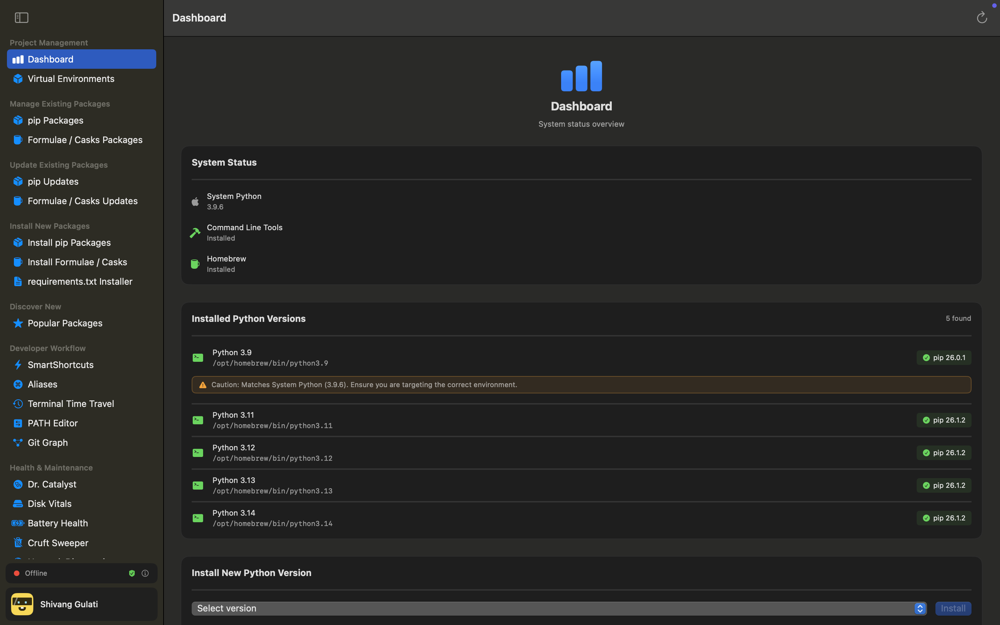
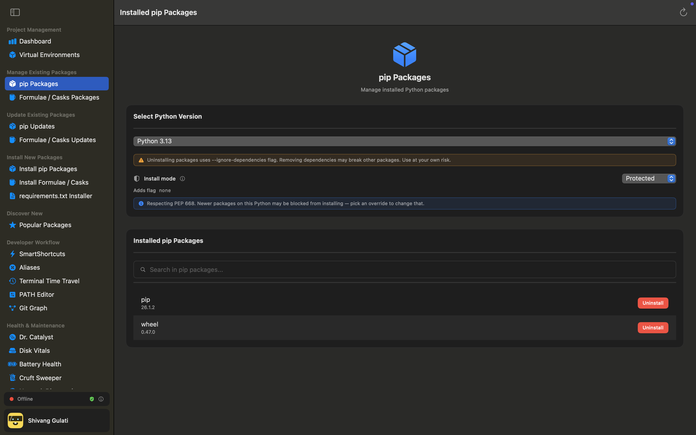
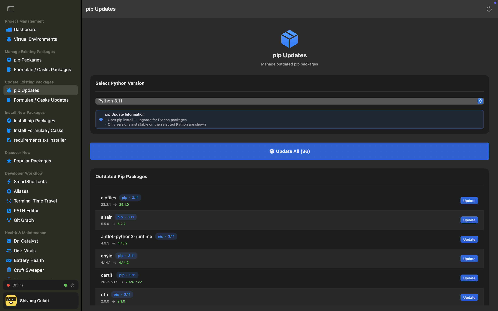
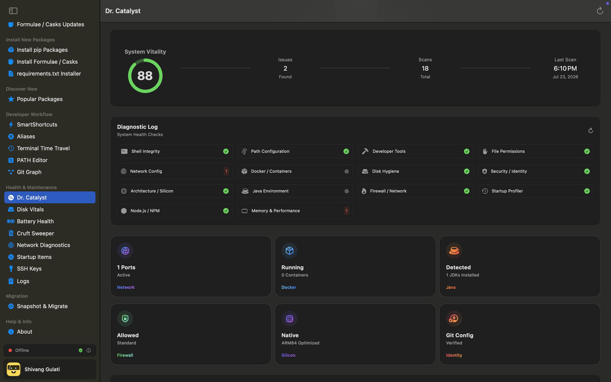
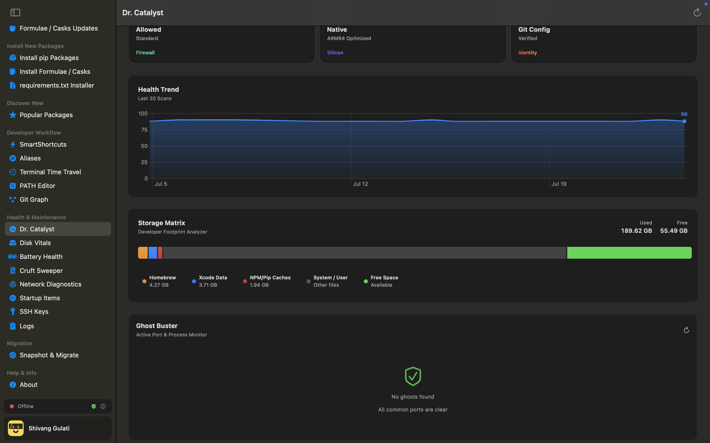
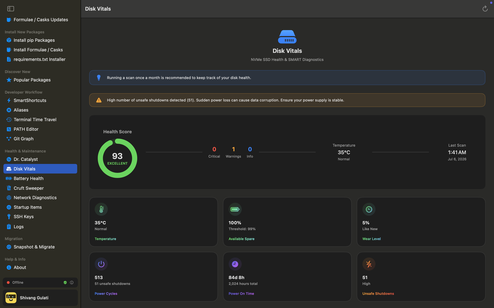
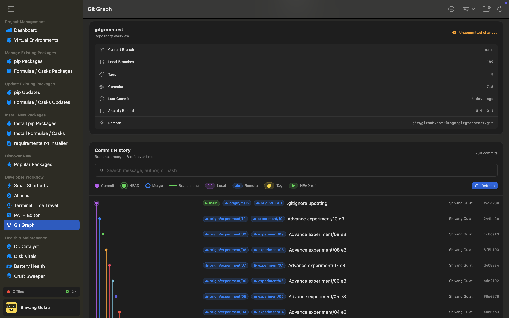
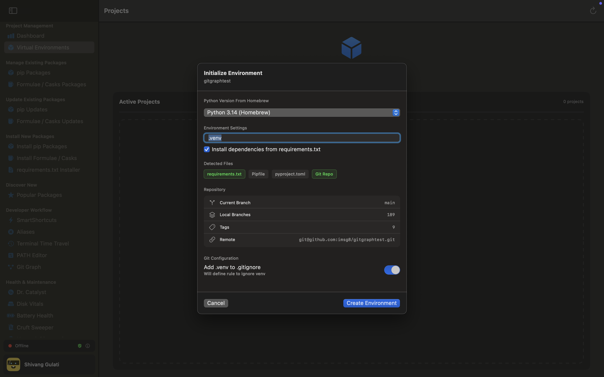
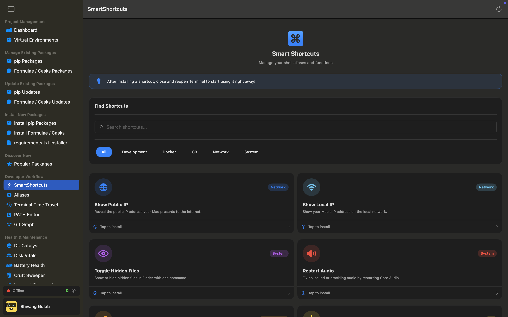
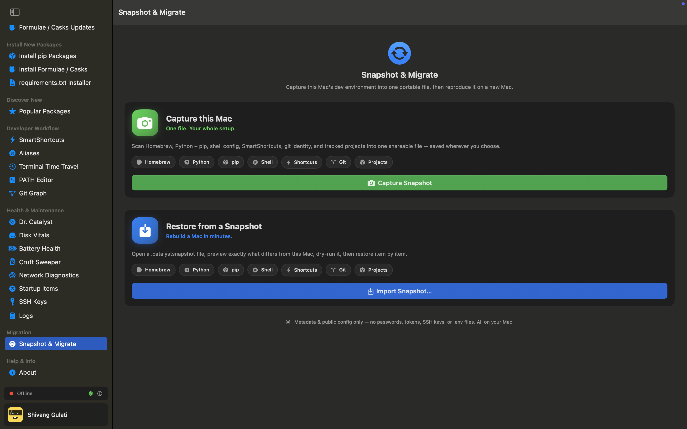

<div align="center">

# Catalyst

**Mission control for your Mac development environment.**

Install, update, clean, and diagnose everything a Mac needs for development —
Python, Homebrew, virtual environments, shell config, disk and battery health —
from one native, dark-themed app. No terminal incantations required, and nothing
destructive without your explicit say-so.

[](LICENSE)
[](#requirements)
[-lightgrey.svg)](#requirements)
[](https://github.com/theappfoundryco/Catalyst/releases/latest)
[](#privacy--security)

[Download](https://github.com/theappfoundryco/Catalyst/releases/latest) ·
[Report a bug](https://github.com/theappfoundryco/Catalyst/issues/new?template=bug_report.yml) ·
[Request a feature](https://github.com/theappfoundryco/Catalyst/issues/new?template=feature_request.yml) ·
[Architecture](docs/ARCHITECTURE.md)

</div>

---

## Contents

- [Why Catalyst](#why-catalyst)
- [Features](#features)
- [What makes it different](#what-makes-it-different)
- [Screenshots](#screenshots)
- [Requirements](#requirements)
- [Install](#install)
- [Updating](#updating)
- [Building from source](#building-from-source)
- [How it works](#how-it-works)
- [Privacy & security](#privacy--security)
- [Project layout](#project-layout)
- [Documentation](#documentation)
- [Contributing](#contributing)
- [License](#license)

---

## Why Catalyst

Setting up and maintaining a Mac for development means living in the terminal: installing Homebrew
formulae and casks, juggling Python versions and pip packages, creating virtual environments,
editing `~/.zshrc` aliases, hunting the process hogging a port, working out why `git` or `node`
suddenly broke, freeing disk space, checking drive and battery health. Every one of those is doable
from the command line — *if* you remember the exact incantation and get the flags right.

Catalyst wraps all of it in a clean, native SwiftUI interface and gives you three things:

- **Visibility** — live system status, health scores, disk maps, SSD and battery vitals.
- **Control** — one-click install, uninstall, and update across pip and Homebrew.
- **Guided maintenance** — a "doctor" that scans, scores, and fixes environment problems, plus
  sweepers that reclaim space.

…without touching a terminal unless you want to — and **without ever doing something destructive or
system-altering without explicit, informed consent.**

Catalyst is a native macOS app written in Swift and SwiftUI. It has no account, no subscription, and
no server. It was a paid product until v1.0; it is now free and open source under the GPLv3.

## Features

Twenty-five screens across nine sidebar sections. Highlights, grouped:

### Packages & environments

| Feature | What it does |
|---|---|
| **Dashboard** | A live snapshot of the environment — what's installed, what's outdated, what needs attention |
| **Virtual environments** | Create, inspect, activate, and remove venvs without touching a terminal |
| **pip packages** | Installed and outdated lists, one-click upgrades, and bulk install from a `requirements.txt` |
| **Homebrew formulae & casks** | The same install / update / remove flow for Homebrew, on both Apple silicon and Intel prefixes |
| **Popular packages** | A curated starting set for a fresh machine |

### Developer workflow

| Feature | What it does |
|---|---|
| **SmartShortcuts** | Curated shell functions, installed and managed through a UI that validates before it writes to your shell config |
| **Aliases** | Add, edit, and remove shell aliases safely, in a managed block — never by hand-editing `~/.zshrc` |
| **PATH editor** | See what's actually on your `PATH`, in order, and fix duplicates or bad ordering |
| **Git graph** | A readable commit graph for any local repository |
| **Terminal time travel** | Search your shell history and re-run anything from it |
| **SSH keys** | Inventory the keys on the machine and flag insecure permissions |

### Health & maintenance

| Feature | What it does |
|---|---|
| **Dr. Catalyst** | One sweep across the whole environment — 16 concurrent diagnostic checkers — with plain-language findings and one-click fixes |
| **Cruft Sweeper** | Find and safely remove build artifacts, caches, and orphaned dependencies |
| **Disk & battery vitals** | SSD health, battery condition, and cycle counts at a glance |
| **Network diagnostics** | Connectivity, DNS, and reachability checks when something's off |
| **Startup items** | See and manage what launches at login |
| **Logs** | The app's own activity, readable, so nothing happens off-screen |

### Migration

| Feature | What it does |
|---|---|
| **Snapshot & migrate** | Capture your entire setup — packages, environments, shortcuts — and rebuild it on another Mac |

### Anywhere

| Feature | What it does |
|---|---|
| **Menu-bar mode** | A `MenuBarExtra` companion for quick status and actions without opening the full window |

A complete, screen-by-screen reference lives in [`docs/ARCHITECTURE.md`](docs/ARCHITECTURE.md).

## What makes it different

- **Consent-first.** Nothing destructive or system-altering happens without an explicit, informed
  approval — most visibly the `--break-system-packages` flow, which is a single global setting you
  turn on knowingly, not a dialog you learn to click through.
- **Local-first, no backend.** There is no server to depend on. The only things Catalyst fetches are
  read-only static JSON catalogs and the update feed — both plain files you can open in a browser.
- **Recoverable by default.** Deletions prefer the Trash over permanent removal, and every
  destructive path is allowlist-gated (see [How it works](#how-it-works)).
- **Auditable telemetry.** There isn't any — and there's exactly one file where it *would* live, so
  the answer to "what does this report about me?" is one place, in public.

## Screenshots

<div align="center">
  
  
</div>
<div align="center">
  
  
</div>
<div align="center">
  
  
</div>
<div align="center">
  
  
</div>
<div align="center">
  
  
</div>

_Screens: Dashboard · pip Packages · pip Updates · Dr. Catalyst · Disk Vitals · Git Graph · Virtual Environments · SmartShortcuts · Snapshot & Migrate._

## Requirements

macOS 14.6 or later. Universal binary — native on both Apple silicon and Intel. Forced dark theme.

## Install

Download the latest signed and notarized build from
[Releases](https://github.com/theappfoundryco/Catalyst/releases/latest) — it's a `.dmg`.

1. Open `Catalyst-<version>.dmg`.
2. Drag **Catalyst** onto the **Applications** folder in the same window.
3. Launch it from Applications.

Installing into `/Applications` matters: an app run straight from Downloads is subject to macOS
Gatekeeper path-randomization, which prevents Catalyst from updating itself in place. Dragging it in
is what keeps auto-update working.

## Updating

Updates arrive in-app via [Sparkle](https://sparkle-project.org). Catalyst checks the feed, downloads
the next version in the background, and shows a **Relaunch to update** badge in the sidebar — one
click installs and relaunches. Every update is Developer ID–signed, notarized, and verified against a
cryptographic (EdDSA) signature before it's applied. There is no separate installer to run.

## Building from source

```sh
git clone https://github.com/theappfoundryco/Catalyst.git
cd Catalyst
open Catalyst.xcodeproj
```

Build and run. There is no backend to stand up, no API key to obtain, and no configuration step.
Sparkle is the only dependency, resolved automatically over Swift Package Manager.

A privileged helper tool handles the few operations that genuinely require elevation. It is installed
on first use with your explicit approval, communicates over XPC, and its source is in
[`PrivilegedHelper/`](PrivilegedHelper).

## How it works

Every feature is a variation on one loop:

```
A click (user intent)
  → a ViewModel builds a safe, sanitized command
     → an execution tier runs it off the main thread
        → output streams back / the exit code is checked
           → @Published state updates → SwiftUI re-renders
```

The app's real value and real risk both live in the middle: **running shell commands on your behalf,
safely.** That's why the execution layer is the most carefully guarded part of the codebase.

- **Three execution tiers.** A non-privileged `actor` runs ordinary commands off the main thread,
  preferring array arguments with no shell and no quoting. A separate privileged path shows a native
  password prompt and pipes the secret straight to `sudo -S` in memory — it is **never written to
  disk**. A third tier hands off to your visible Terminal for the rare cases you must watch (chiefly
  the Homebrew install script).
- **Everything is sanitized.** Package names pass an ASCII allowlist; paths and arguments go through a
  single, disciplined quoting layer before any of them reach a shell.
- **Every destructive delete is allowlist-gated.** Only Homebrew, cache, log, and virtualenv
  directories are ever deletable; `/System`, `/Library`, and your Documents / Desktop / Downloads are
  blocked, and `.ssh`, `.Trash`, and `.git` are hard-skipped everywhere. Recoverable Trash is
  preferred over permanent removal.
- **Success is decided on exit codes, never by scraping text output.**

The deeper design — layers, the composition root, the safety invariants — is documented in
[`docs/ARCHITECTURE.md`](docs/ARCHITECTURE.md).

## Privacy & security

**Catalyst sends nothing about you.** No analytics SDK, no crash reporter, no account, no identifier.
Firebase Analytics and Crashlytics were removed at v1.0.

The app makes exactly two kinds of network request, both `GET`s for static files you can open in a
browser yourself:

| Request | Purpose |
|---|---|
| `data.theappfoundry.co/catalyst/…` | The package catalogs shown in the app |
| `updates.theappfoundry.co/catalyst/appcast.xml` | The Sparkle update feed |

[`Telemetry/Telemetry.swift`](Telemetry/Telemetry.swift) remains as a single choke point where a
provider *could* be wired in; every method is a no-op outside debug builds. It's kept deliberately —
one file that answers "what does Catalyst report about me?" is easier to audit than provider calls
scattered across 167 source files. If that ever changes, it changes there, in public, in a commit you
can read.

Found a security issue? Please report it privately — see [`SECURITY.md`](SECURITY.md).

## Project layout

```
Catalyst/          App entry, Info.plist, legal consent
Views/             SwiftUI screens (25, across 9 sidebar sections)
ViewModels/        Screen state and orchestration; AppViewModel is the composition root
Services/          Shell execution, brew, pip, git, snapshot, privileges
Checkers/          Dr. Catalyst diagnostic modules (16 concurrent + StorageDoctor)
Utilities/         Process runner, input sanitizing, networking, brew-path resolution
PrivilegedHelper/  Privileged helper tool (XPC)
Scripts/           Release tooling (DMG build, notarization, Sparkle appcast)
docs/              Architecture, conventions, anti-patterns, and the release runbook
```

- **Language / UI:** Swift + SwiftUI (MVVM + a service layer, manual dependency injection)
- **Entry point:** `Catalyst/CatalystApp.swift`
- **Bundle ID:** `com.shivanggulati.catalyst`
- **Backend:** none — two GitHub Pages sites of read-only static JSON

## Documentation

| Document | What it covers |
|---|---|
| [`ARCHITECTURE.md`](docs/ARCHITECTURE.md) | How the pieces fit together, plus a full screen-by-screen feature reference |
| [`CODING_STANDARDS.md`](docs/CODING_STANDARDS.md) | Conventions and invariants this codebase holds to |
| [`ANTI_PATTERNS.md`](docs/ANTI_PATTERNS.md) | Specific mistakes made here before, and what to do instead |
| [`RELEASING.md`](docs/RELEASING.md) | The release and hosting runbook |

[`ANTI_PATTERNS.md`](docs/ANTI_PATTERNS.md) is worth reading before your first change — a list of
things that looked correct, shipped, and broke, each with the rule that came out of it. Code comments
cite these by name (`// CODING_STANDARDS 12.27`, `// ANTI_PATTERNS Rule 1`), so when you hit one while
reading, that's the file it points to.

## Contributing

Issues and pull requests are welcome. For anything substantial, open an issue first describing what
you'd like to do — it saves you building something that conflicts with work already in flight.

Two things to know:

1. **This codebase documents *why*, not *what*.** Comments explaining a non-obvious decision, a race
   that was fixed, or a trap already fallen into are load-bearing. Please write in the same spirit,
   and don't delete one without understanding what it protected.
2. **Catalyst runs against a real machine.** It uninstalls packages, edits shell config, and performs
   privileged operations. "It builds" is not testing — say what you actually ran.

## License

[GNU General Public License v3.0](LICENSE).

You can use, study, modify, and redistribute Catalyst. If you distribute a modified version, it has
to stay under the GPL with its source available. What was built in the open stays open.

<div align="center">
<sub>Built by <a href="https://theappfoundry.co">The App Foundry</a></sub>
</div>
