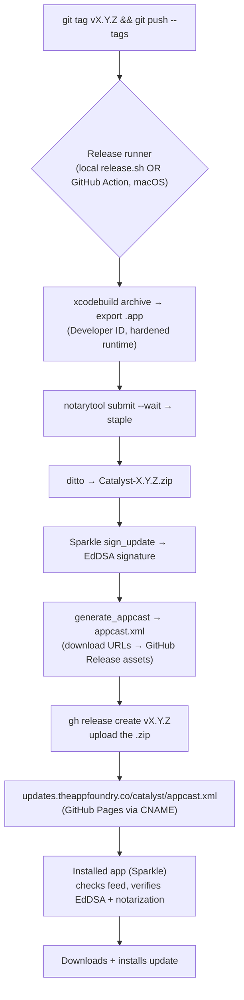

# Catalyst — Releasing & Auto-Update (P9)

How to ship a signed, notarized build that users auto-update via **Sparkle + GitHub Releases**.
Two independent signatures (Apple notarization for Gatekeeper, Sparkle EdDSA for feed trust),
one source of truth (GitHub Releases), one command to ship (`git tag && git push --tags`).

Repos: the **app** lives in `theappfoundryco/Catalyst` (this repo) — that's where Releases live. The
**appcast feed** is served from `updates.theappfoundry.co/catalyst/appcast.xml` — a custom domain
CNAME'd to GitHub Pages on `theappfoundryco/updates`. GitHub Releases on this repo host the `.zip`.

The custom domain is load-bearing: `SUFeedURL` is compiled into every build and can never be
changed for installs already in the wild, so it must point at a hostname we can repoint forever.
Catalyst has already been stranded once by a vendor URL — the Cloudflare Worker this feed used to
run on was deleted, and every install pointing at it would have silently stopped updating.

---

## Pipeline



**Hard requirement:** every build must be **codesigned with a Developer ID + notarized**, or
macOS Gatekeeper blocks the update from launching. This is why P9 needed the Apple Developer
account.

---

## Hosting — one-time, shared by every App Foundry app

Two hostnames, two repos, and they are **studio-wide**. Every app gets a path segment under
them, never its own subdomain — so shipping app #2 means adding a folder, not touching DNS.

| Host | Repo | Serves | Catalyst's path |
|---|---|---|---|
| `updates.theappfoundry.co` | `theappfoundryco/updates` | Appcast feeds **+ per-version metadata** | `/catalyst/appcast.xml` |
| `data.theappfoundry.co` | `theappfoundryco/data` | Read-only JSON catalogs | `/catalyst/public/...` |

Binaries do NOT live in these repos. Each release's `.zip` is a **GitHub Release asset on the
app's own repo** (`theappfoundryco/Catalyst`) and the appcast merely points at that download URL.
There is no separate releases repo — that split existed only because the source was private and
Sparkle needs unauthenticated downloads. Both are public now, so it bought nothing.

### 1. `theappfoundryco/updates`

```
updates/
  CNAME                              ← one line: updates.theappfoundry.co
  index.html                         ← optional landing page
  catalyst/
    appcast.xml                      ← Sparkle feed, regenerated each release
    CHANGELOG.md
    Versions/<version>/notes.html    ← release body, also the appcast <description>
    Versions/<version>/meta.env      ← cached EdDSA signature + length
```

`meta.env` is the one irreplaceable file in the pipeline. A historical version is **never
re-signed**, so if it's lost that version's signature is unrecoverable and its entry has to be
dropped from the feed — which breaks upgrades for anyone still on an older build. The `.zip` is
not stored here: it's built into `build/` (gitignored) and uploaded to the Release.

Create the repo public → Settings → Pages → Source: `main`, folder `/` → Custom domain:
`updates.theappfoundry.co` → tick **Enforce HTTPS** once the cert issues (a few minutes).

### 2. `theappfoundryco/data`

```
data/
  CNAME                    ← one line: data.theappfoundry.co
  catalyst/
    health.json            ← {"ok":true} — the app's liveness probe
    public/
      shortcuts/           ← index.json + <id>.json
      brew/                ← homebrew_formulae.json, homebrew_casks.json
      pypi/                ← <prefix>.json shards
      popular/             ← curated lists
```

Same Pages setup with `data.theappfoundry.co`. The `public/` level is kept because the app
composes every path from `APIEndpoint.baseURL` — flattening it would mean touching six constants
for no gain.

**The Catalyst JSON is recoverable from the old `catalyst_cloudflare` repo** (formerly deployed
to Cloudflare Pages, since deleted). Preserve the `public/...` layout when moving it across.

### 3. DNS

Wherever `theappfoundry.co` resolves today (the apex points at Vercel for the marketing site —
leave that alone), add two records:

```
CNAME  updates  →  theappfoundryco.github.io.
CNAME  data     →  theappfoundryco.github.io.
```

GitHub matches the request to the right repo by the `CNAME` file in each, so both subdomains
share one target. Verify:

```sh
dig +short updates.theappfoundry.co
curl -sI https://updates.theappfoundry.co/catalyst/appcast.xml | head -1
curl -s  https://data.theappfoundry.co/catalyst/health.json
```

### Why custom domains rather than `*.github.io`

`SUFeedURL` and `baseURL` are compiled into builds that sit on people's machines for years and
cannot be changed retroactively. A CNAME can be repointed at any host forever; a vendor URL is a
permanent dependency on one company's product decisions. Catalyst has already been stranded
twice this way — the Cloudflare Pages project and Worker these paths used to point at were both
deleted, which silently emptied every catalog screen and would have killed auto-update outright.

### Adding app #2

1. `mkdir updates/<app>/` and `data/<app>/` in the two existing repos.
2. Set the new app's `SUFeedURL` to `https://updates.theappfoundry.co/<app>/appcast.xml`.
3. Point its release script's appcast output at `updates/<app>/appcast.xml`.

No DNS changes, no new Pages sites, no new certificates.

---

## One-time setup

### A. Apple — signing identity + notarization credentials

1. In Xcode → Settings → Accounts, add your Apple ID (the Developer Program one).
2. Create a **Developer ID Application** certificate (Xcode → Settings → Accounts → Manage
   Certificates → +, or via the Developer portal). Confirm it's in your login Keychain:
   ```
   security find-identity -v -p codesigning
   ```
   Note the identity string: `Developer ID Application: Your Name (TEAMID)`.
3. Create an **app-specific password** at appleid.apple.com → Sign-In & Security → App-Specific
   Passwords. Then store a reusable notarization profile:
   ```
   xcrun notarytool store-credentials CATALYST_NOTARY \
     --apple-id "you@icloud.com" --team-id "TEAMID" --password "abcd-efgh-ijkl-mnop"
   ```

### B. Sparkle — tools + EdDSA keys

1. Get the Sparkle tools (the SPM package is already linked in the app; the CLI tools ship in
   the Sparkle release zip from github.com/sparkle-project/Sparkle/releases → `bin/`). Put
   `generate_keys`, `sign_update`, `generate_appcast` on your PATH (e.g. copy into `./scripts/`).
2. Generate the EdDSA keypair once (private key goes into your login Keychain, public is printed):
   ```
   ./scripts/generate_keys
   ```
   Copy the printed **public key** (base64) — it goes in Info.plist as `SUPublicEDKey`. Back up
   the private key (`generate_keys -x sparkle_private.key`) somewhere safe and **never commit it**.

### C. Xcode — Info.plist + hardened runtime

Add to `Catalyst/Info.plist`:
```xml
<key>SUFeedURL</key>
<string>https://updates.theappfoundry.co/catalyst/appcast.xml</string>
<key>SUPublicEDKey</key>
<string>PASTE_THE_BASE64_PUBLIC_KEY_FROM_generate_keys</string>
<key>SUEnableAutomaticChecks</key>
<true/>
<key>SUScheduledCheckInterval</key>
<integer>86400</integer>
```
In the target's **Signing & Capabilities**: set signing to your Developer ID team, and enable
**Hardened Runtime** (required for notarization). Sparkle 2 needs no extra entitlements for a
non-sandboxed app.

### D. App code — wire the updater + a menu item

Sparkle drives its own update UI out of the box. Add an updater controller and a "Check for
Updates…" menu item. Create `Helpers/UpdaterController.swift` (register it in `project.pbxproj`
under the next free prefix, `CO`):
```swift
import Sparkle

/// Owns the Sparkle updater. `startingUpdater: true` begins the scheduled background checks
/// (interval from Info.plist `SUScheduledCheckInterval`). Expose it to a menu item.
final class UpdaterController {
    static let shared = SPUStandardUpdaterController(
        startingUpdater: true, updaterDelegate: nil, userDriverDelegate: nil)
}
```
Add the menu item (in the `MenuBarExtra` menu and/or the main menu):
```swift
Button("Check for Updates…") { UpdaterController.shared.updater.checkForUpdates() }
```
(Optional, later: a custom sidebar "Downloading update…" indicator like the Claude app uses a
custom `SPUUserDriver` — the standard Sparkle window works fine for v1.)

### E. GitHub — the `gh` CLI

`brew install gh && gh auth login`. Releases are created on `theappfoundryco/Catalyst`.

---

## Cutting a release

Two options — a local script (simplest) or GitHub Actions on tag push.

### Option 1 — local `scripts/release.sh`

```bash
#!/usr/bin/env bash
set -euo pipefail

VERSION="${1:?usage: release.sh X.Y.Z}"
SCHEME="Catalyst"
IDENTITY="Developer ID Application: Your Name (TEAMID)"
NOTARY_PROFILE="CATALYST_NOTARY"
DL_PREFIX="https://github.com/theappfoundryco/Catalyst/releases/download/v${VERSION}/"
BUILD="$(pwd)/build"; RELEASES="$(pwd)/releases"
mkdir -p "$BUILD" "$RELEASES"

echo "▸ Archiving…"
xcodebuild -scheme "$SCHEME" -configuration Release \
  -archivePath "$BUILD/Catalyst.xcarchive" archive \
  CODE_SIGN_IDENTITY="$IDENTITY" -allowProvisioningUpdates

echo "▸ Exporting…"
xcodebuild -exportArchive -archivePath "$BUILD/Catalyst.xcarchive" \
  -exportPath "$BUILD/export" -exportOptionsPlist scripts/exportOptions.plist
APP="$BUILD/export/Catalyst.app"

echo "▸ Zipping for notarization…"
ZIP="$RELEASES/Catalyst-${VERSION}.zip"
ditto -c -k --keepParent "$APP" "$ZIP"

echo "▸ Notarizing (waits)…"
xcrun notarytool submit "$ZIP" --keychain-profile "$NOTARY_PROFILE" --wait
xcrun stapler staple "$APP"

echo "▸ Re-zipping the stapled app…"
rm "$ZIP"; ditto -c -k --keepParent "$APP" "$ZIP"

echo "▸ Sparkle EdDSA signature + appcast…"
./scripts/generate_appcast --download-url-prefix "$DL_PREFIX" "$RELEASES"
# → writes/updates releases/appcast.xml with the signed entry for this version.

echo "▸ Publishing GitHub Release…"
gh release create "v${VERSION}" "$ZIP" "$RELEASES/appcast.xml" \
  --repo theappfoundryco/Catalyst --title "Catalyst ${VERSION}" --generate-notes

echo "✅ Released v${VERSION}. Feed live at updates.theappfoundry.co/catalyst/appcast.xml shortly."
```

`scripts/exportOptions.plist` (Developer ID export):
```xml
<?xml version="1.0" encoding="UTF-8"?>
<!DOCTYPE plist PUBLIC "-//Apple//DTD PLIST 1.0//EN" "http://www.apple.com/DTDs/PropertyList-1.0.dtd">
<plist version="1.0"><dict>
  <key>method</key><string>developer-id</string>
  <key>teamID</key><string>TEAMID</string>
  <key>signingStyle</key><string>manual</string>
</dict></plist>
```

Ship: `chmod +x scripts/release.sh && ./scripts/release.sh 1.0.1`.

### Option 2 — GitHub Actions on tag push (`.github/workflows/release.yml`)

Runs the same steps on a **macOS runner**, triggered by `git push --tags`. Store as repo
secrets: `MACOS_CERT_P12` (base64 of the Developer ID cert .p12), `MACOS_CERT_PASSWORD`,
`APPLE_ID`, `APPLE_TEAM_ID`, `APPLE_APP_PW` (app-specific pw), `SPARKLE_PRIVATE_KEY`.
```yaml
name: release
on:
  push:
    tags: ["v*"]
jobs:
  release:
    runs-on: macos-14
    steps:
      - uses: actions/checkout@v4
      - name: Import signing cert
        run: |
          echo "$MACOS_CERT_P12" | base64 -d > cert.p12
          security create-keychain -p ci build.keychain
          security import cert.p12 -k build.keychain -P "$MACOS_CERT_PASSWORD" -T /usr/bin/codesign
          security set-key-partition-list -S apple-tool:,apple: -s -k ci build.keychain
          security list-keychains -s build.keychain
        env: { MACOS_CERT_P12: "${{ secrets.MACOS_CERT_P12 }}", MACOS_CERT_PASSWORD: "${{ secrets.MACOS_CERT_PASSWORD }}" }
      - name: Store notary credentials
        run: xcrun notarytool store-credentials CATALYST_NOTARY --apple-id "$APPLE_ID" --team-id "$APPLE_TEAM_ID" --password "$APPLE_APP_PW"
        env: { APPLE_ID: "${{ secrets.APPLE_ID }}", APPLE_TEAM_ID: "${{ secrets.APPLE_TEAM_ID }}", APPLE_APP_PW: "${{ secrets.APPLE_APP_PW }}" }
      - name: Build, notarize, sign, release
        run: |
          echo "$SPARKLE_PRIVATE_KEY" > sparkle_private.key   # sign_update -f sparkle_private.key
          ./scripts/release.sh "${GITHUB_REF_NAME#v}"
        env: { SPARKLE_PRIVATE_KEY: "${{ secrets.SPARKLE_PRIVATE_KEY }}", GH_TOKEN: "${{ github.token }}" }
```

---

## Wire the website download

Once a release exists, point the site's download link at this repo's Releases page:
`https://github.com/theappfoundryco/Catalyst/releases/latest`

Link to the *page*, not a direct asset URL — the asset name embeds the version
(`Catalyst-1.0.zip`), so `…/latest/download/Catalyst-<version>.zip` breaks on every bump. The
Releases page always resolves. Push → Vercel redeploys.

## Verify

```
curl -s https://updates.theappfoundry.co/catalyst/appcast.xml | head   # served feed
```
In the app: **Check for Updates…** → Sparkle should find nothing on the current version, and
offer the update after you ship a higher `CFBundleVersion`/`CFBundleShortVersionString`.

## Gotchas

- **Version-only:** bump `MARKETING_VERSION` each release. `CURRENT_PROJECT_VERSION = $(MARKETING_VERSION)`
  makes `CFBundleVersion` track it, and `sparkle:version` = the marketing version — Sparkle's comparator
  orders 1.1 > 1.0. (Older note below about bumping a separate build number no longer applies.)
- **Notarize before stapling**, and **re-zip after stapling** (the ticket is stapled into the
  `.app`, so the zip must be regenerated).
- GitHub Pages caches the feed briefly — a fresh release shows up within a minute or so.
- Keep the Sparkle **private key** out of git (Keychain locally, a GitHub secret in CI). Only
  `SUPublicEDKey` ever ships in the app.
- Same client-holds-public-key / server-holds-private-key model as the entitlement JWT.

---

## Appendix — minting & handing out gift codes (P11)

*Design/spec lives in `goLive.md` → P11. This is the repeatable ops procedure once P11 ships.*
Codes are single-use, grant 1 month / 1 year of Pro, stored **hashed** in D1; the plaintext exists
only in the file you generate here and hand out.

**Mint a batch** (`scripts/mint-codes.mjs`, run locally):
```js
import { createHash, randomInt } from "node:crypto";
import { writeFileSync } from "node:fs";

const N     = Number(process.argv[2] ?? 50);        // how many
const PLAN  = process.argv[3] ?? "month";           // month | year
const BATCH = process.argv[4] ?? new Date().toISOString().slice(0, 10);
const LEN   = PLAN === "year" ? 16 : 12;
const AB    = "ABCDEFGHJKMNPQRSTVWXYZ23456789";      // Crockford-ish: no 0 O 1 I L U

const norm = c => c.toUpperCase().replace(/[^A-Z0-9]/g, "");
const hash = c => createHash("sha256").update(norm(c)).digest("hex");
const pretty = c => c.match(/.{1,4}/g).join("-");
const gen = () => Array.from({ length: LEN }, () => AB[randomInt(AB.length)]).join("");

const plain = [], sql = [];
for (let i = 0; i < N; i++) {
  const c = gen();
  plain.push(pretty(c));
  sql.push(`INSERT INTO redemption_codes (code_hash,plan,status,batch,created_at) VALUES ('${hash(c)}','${PLAN}','unused','${BATCH}',strftime('%s','now'));`);
}
writeFileSync(`codes-${PLAN}-${BATCH}.txt`, plain.join("\n"));      // ← hand these out; keep secure
writeFileSync(`codes-${PLAN}-${BATCH}.sql`, sql.join("\n"));
console.log(`Minted ${N} ${PLAN} codes → codes-${PLAN}-${BATCH}.txt`);
```
```
node scripts/mint-codes.mjs 100 month launch-giveaway
node scripts/mint-codes.mjs 25  year  press-kit
wrangler d1 execute catalyst-db --remote --file=codes-month-launch-giveaway.sql
```

**Distribute:** hand out the plaintext from `codes-*.txt`. **Gitignore** both output files
(`codes-*.txt`, `codes-*.sql`) — the `.txt` is the only place plaintext exists.

**Revoke a leaked batch:**
```
wrangler d1 execute catalyst-db --remote --command "UPDATE redemption_codes SET status='revoked' WHERE batch='launch-giveaway' AND status='unused'"
```

**Audit a batch** (how many claimed):
```
wrangler d1 execute catalyst-db --remote --command "SELECT status, COUNT(*) FROM redemption_codes WHERE batch='launch-giveaway' GROUP BY status"
```

---

## Distribution — where each artifact lives (2026-07-21, current)

**Everything ships from this repo.** `theappfoundryco/Catalyst` holds the source AND the GitHub
Releases that host each `.zip`. The appcast and its per-version metadata live in
`theappfoundryco/updates`, served at `updates.theappfoundry.co/catalyst/appcast.xml`.

There used to be a third repo, `Catalyst_Releases`, holding binaries separately from source. That
split existed only because the source was **private** and Sparkle fetches the appcast and `.zip`
**unauthenticated** — GitHub's release URLs aren't publicly downloadable for a private repo, so a
private-source setup 404s the feed. Once the source went public at v1.0 the constraint vanished and
the repo was retired: one fewer clone, one fewer push that can half-fail.

| Artifact | Lives in | Committed to git? |
|---|---|---|
| `Catalyst-<v>.zip` | GitHub Release asset on `theappfoundryco/Catalyst` | **No** — built into gitignored `build/` |
| `appcast.xml` | `updates/catalyst/` | Yes |
| `notes.html`, `meta.env` | `updates/catalyst/Versions/<v>/` | Yes |
| `CHANGELOG.md` | `updates/catalyst/` | Yes |

```
updates/                                  ← sibling clone of theappfoundryco/updates
  CNAME
  catalyst/
    appcast.xml                           ← cumulative feed (regenerated every release)
    CHANGELOG.md
    Versions/<version>/
        notes.html                        ← release body, and the appcast <description>
        meta.env                          ← VERSION, PUBDATE, MIN_OS, SIG, LENGTH
```

**The `.zip` is never committed.** It's built into `build/`, uploaded to the Release, and left
there. Previously each version's zip was committed too (~10 MB each, 128 MB by v1.12) and pruned
on the next release by a dedicated retention policy — machinery that existed only to clean up
after a decision that didn't need making. The Release is the download host and `meta.env` already
carries `SIG` and `LENGTH`, so `make_appcast.py` never needs the local file.

**Never delete `meta.env`.** It is the only irreplaceable file in the pipeline: a historical
version is never re-signed, so losing it means that version is silently dropped from the feed —
which breaks upgrades for anyone still running it.

**How it's wired:**
- The feed is `updates/catalyst/appcast.xml`, published by GitHub Pages via the repo's `CNAME`.
  Pushing the repo publishes the feed — there is nothing to deploy.
- Zips are per-version GitHub **Releases** on this repo, tag `vX.Y.Z` — a proper CDN and the
  archive of record.
- Enclosure URL: `https://github.com/theappfoundryco/Catalyst/releases/download/v<version>/Catalyst-<version>.zip`

**Debug guard (2026-07-17) — the very first thing `cut_release.sh` does.** Before the notes prompt or any
build, it reads the Release build settings (`xcodebuild -scheme Catalyst -configuration Release
-showBuildSettings`) and **aborts** if `SWIFT_ACTIVE_COMPILATION_CONDITIONS` contains `DEBUG` (or the config
doesn't resolve to `Release`). This means a debug build — and the `#if DEBUG` `🐛` detection logging — can
never ship, and you learn it in ~3s instead of after writing notes + a 10-minute build. `preflight_release.sh`
re-checks the same (plus hardened runtime, optimization, signing, scheme ArchiveAction) later as the full gate.

**Cutting a release — one command (rewritten 2026-07-16, now truly one run):** `./Scripts/cut_release.sh`
(see the script header). Flow: bump `MARKETING_VERSION` in Xcode → run the script → **fail-fast debug guard**
→ it **prompts you
for release-note bullets in the terminal** (one per line, blank line ends), shows a preview with
`[p]roceed / [r]etype in terminal / [e]dit in $EDITOR / [a]bort` → builds → exports (Developer ID) →
notarizes → staples → re-zips → `sign_update` (caches SIG into `meta.env`) →
`make_appcast.py` regenerates `appcast.xml` into the `updates` repo → `gh release create` uploads the zip → **deprecates every
predecessor** (`add_deprecation_note` **refreshes a single** `⚠️ Deprecated` banner in each old
`notes.html` — it REPLACES any prior banner, so the pointer always names the latest version, banners
never stack, and the legacy pre-marker "no longer maintained" banner is auto-stripped — + `gh release
adds a notes banner only, keeping each `.zip` so appcast enclosures stay valid; the just-shipped
version is never touched). **Authoring caveat:** the banner strip matches ASCII substrings
(`catalyst:deprecated`, `this version is superseded`, `no longer maintained`) — don't use those exact
phrases in real release-note bullets, or they'll be removed on the next deprecation pass. → auto-prepends a dated entry to **`updates/catalyst/CHANGELOG.md`** built
from the same bullets → `sync_release_notes.sh` → `git add -A` + `git pull --rebase` + push.

**Flags:** `--dry-run` (print the full plan — version, predecessors to deprecate,
git actions — and exit; **no build, no deletes, no push**), `--deprecate-only` (skip the build; just
re-run the deprecation + sync + push), `--yes` (skip the "confirm asset deletion" prompt). Version
bump stays a manual Xcode pre-step; the script aborts if that version's `meta.env` already exists.

`make_appcast.py` scans `Versions/*/`, uses each `meta.env`'s cached SIG/LENGTH (so historical
versions are **never re-signed**), embeds `notes.html` as `<description>`, and sorts newest build
first. Runs standalone too: `python3 Scripts/make_appcast.py updates/catalyst`.

**Release notes — two places, edit only `notes.html` (2026-07-14b).** `notes.html` feeds BOTH the
appcast `<description>` (regenerated every run — good) AND the GitHub Release body (set **once** by
`gh release create --notes-file` and **never re-synced** if you edit `notes.html` later). So a notes
fix after a release updates the in-app popover but leaves the GitHub page stale. To re-push notes to
already-published Releases: **`./Scripts/sync_release_notes.sh [versions…]`** (`gh release edit` per
version; skips placeholders; run on your Mac). `cut_release.sh` now **aborts if `notes.html` still
contains the seed line** "Describe what changed in this release." — so an un-edited template can't ship.

**"Source code (zip / tar.gz)" on each Release** are GitHub's **auto-generated** archives of this
repo at that tag. They can't be disabled. Sparkle only ever pulls `Catalyst-<version>.zip` (the
appcast `<enclosure>`), so they're harmless — and now that the source is public and binaries are no
longer committed, they're a genuinely useful source snapshot rather than a bloated duplicate.

**Check-on-open (2026-07-14c).** `UpdaterController.checkOnLaunch()` (called from the root `.task`)
forces one background check ~3s after launch, guarded by `updater.canCheckForUpdates`. Without it the
badge often didn't appear on open — Sparkle's scheduler only launch-checks after `SUScheduledCheckInterval`
(1h) since the last check and defers the first check on a fresh install. **Testing implication:** you can
only see auto-update from a build **older than the feed's top item, installed in `/Applications`** — a
build at/above the newest feed version checks and correctly shows nothing, and a dev build run from
Xcode/DerivedData won't self-update at all. To validate: cut vX, install it, cut vX+1, relaunch vX →
badge appears within a few seconds. Diagnose with `log stream --info --predicate 'process == "Catalyst"
AND senderImagePath CONTAINS[c] "Sparkle"'` (real Sparkle lines; ignore incidental "…update…" noise).

**App-side custom update UX (P9, done — verified live):** `UpdaterController` (in `CatalystApp.swift`)
adopts Sparkle's "gentle reminders" + `SUAutomaticallyUpdate` (Info.plist) so updates **download
silently**, and a sidebar badge ("Update available" → "Downloading…" → "Relaunch to update";
`SidebarUpdateBadge`/`UpdateBadgeView` in `ContentView.swift`) shows instead of Sparkle's window.
The badge is driven off the real lifecycle callbacks — crucially `updater(_:willInstallUpdateOnQuit:
immediateInstallationBlock:)`, which fires the instant the silent download finishes: we stash the
install block, show **"Relaunch to update"**, and return `true`, so tapping the badge installs +
relaunches with **no Sparkle window** (the gentle-reminder *show* callback is deferred in auto-download
mode, so we don't rely on it). Tapping ⓘ opens a popover with the release notes. `SUScheduledCheckInterval
= 3600` (hourly) + an on-launch check. All Sparkle delegate signatures verified against the 2.x headers.
Note: this UX lives in the *installed* build — a build shows the badge only for updates newer than itself.

**Version-only (no build numbers).** We ship marketing versions only (1.0 → 1.1 → 1.2). The appcast's
`sparkle:version` is set to the **marketing version** and Sparkle's comparator orders dotted versions
correctly (1.1 > 1.0), so **just bump `MARKETING_VERSION` in Xcode** each release — nothing else. The
target sets `CURRENT_PROJECT_VERSION = $(MARKETING_VERSION)` so `CFBundleVersion` tracks it automatically
(the installed app then compares the same string the feed advertises). `cut_release.sh` reads only the
marketing version and refuses to overwrite an already-released one.

**Gotchas (each one bit us):**
- **You MUST bump `MARKETING_VERSION` every release.** Re-releasing the same version → same
  `sparkle:version` → **no update fires**. *(This — plus the appcast never being regenerated for 1.1 —
  is why v1.0→v1.1 never updated: the old project also left the build number at 1 for both.)*
- GitHub Pages caches the feed briefly — allow a minute before re-checking `curl -s https://updates.theappfoundry.co/catalyst/appcast.xml | head`.
- **The installed base build must already be Sparkle-capable** (correct `SUFeedURL` + real `SUPublicEDKey`,
  same key that signs updates) and have a *lower* build number, or it can't verify/see the update. Sparkle
  fails **silently** on any mismatch — check Console.app filtered on "Sparkle".
- Don't hand-edit `updates/catalyst/appcast.xml`; it's regenerated. `notes.html` is the thing you edit.
- **After editing `notes.html` on an already-published version, run `./Scripts/sync_release_notes.sh`** — the appcast (in-app "what's new") is regenerated on push, but the GitHub Release **body** was set once at `gh release create` and won't change otherwise (you'll keep seeing the old text / "Describe what changed…" on the Releases page).
- **`Scripts/delete_archive_release_builds.sh`** removes `build/` (the `.xcarchive` and `export/`), Catalyst's DerivedData, and archived builds after a release — they're regenerated each cut and otherwise linger in Spotlight as extra "Catalyst" hits. `build/` is gitignored; safe to wipe anytime.
